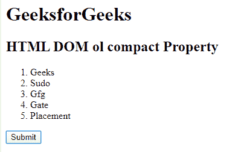
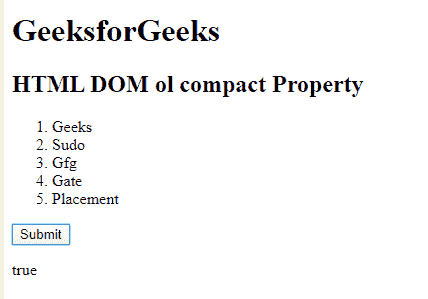
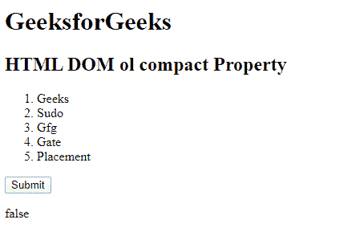

# HTML | DOM ol 紧凑属性

> 原文:[https://www.geeksforgeeks.org/html-dom-ol-compact-property/](https://www.geeksforgeeks.org/html-dom-ol-compact-property/)

**HTML DOM ol 紧凑属性**用于设置或返回< ol >标签中的紧凑属性的值。compact 属性用于通过减少列表项之间的空间和列表的缩进来定义应小于正常值的列表。它是一个布尔属性。

**语法:**

*   它返回一个紧凑的属性。

```html
olObject.compact
```

*   它用于设置 ol compact 属性。

```html
olObject.compact = "True/false";
```

**属性值:**

*   **true:** 定义设置了紧凑属性。
*   **false:** 定义没有设置紧凑属性。

**返回值:**它返回一个字符串值，表示紧凑属性设置为真或假。
T3】例:

```html
<!DOCTYPE html> 
<html> 

<head> 
    <title>HTML DOM ol compact Property</title> 
</head> 

<body> 
    <h1>GeeksforGeeks</h1> 
    <h2> HTML DOM ol compact Property </h2> 
    <ol id="Geeks" type="1" compact> 

        <!-- Assigning id to 'li tag' -->
        <li id="GFG">Geeks</li> 
        <li>Sudo</li> 
        <li>Gfg</li> 
        <li>Gate</li> 
        <li>Placement</li> 
    </ol> 
    <button onclick="myGeeks()">Submit</button> 
    <p id="sudo"></p> 
    <script> 
        function myGeeks() { 
            // Accessing 'ol' tag. 
            var g = document.getElementById( 
            "Geeks").compact; 
            document.getElementById( 
            "sudo").innerHTML = g; 
        } 
    </script> 
</body> 

</html> 
```

**输出:**
**点击按钮前:**



**点击按钮后:**



**例 2:**

```html
<!DOCTYPE html> 
<html> 

<head> 
    <title>HTML DOM ol compact Property</title> 
</head> 

<body> 
    <h1>GeeksforGeeks</h1> 
    <h2> HTML DOM ol compact Property </h2> 
    <ol id="Geeks" type="1" compact> 

        <!-- Assigning id to 'li tag' -->
        <li id="GFG">Geeks</li> 
        <li>Sudo</li> 
        <li>Gfg</li> 
        <li>Gate</li> 
        <li>Placement</li> 
    </ol> 
    <button onclick="myGeeks()">Submit</button> 
    <p id="sudo"></p> 
    <script> 
        function myGeeks() { 
            // Accessing 'ol' tag. 
            var g = document.getElementById( 
            "Geeks").compact = "false"; 
            document.getElementById( 
            "sudo").innerHTML = g; 
        } 
    </script> 
</body> 

</html> 
```

**输出:**
**点击按钮前:**


**点击按钮后:**

