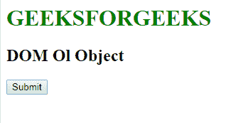

# HTML |DOM OL 对象

> 原文:[https://www.geeksforgeeks.org/html-dom-ol-object/](https://www.geeksforgeeks.org/html-dom-ol-object/)

**DOM Ol 对象**用于表示 HTML < ol >元素。 *ol* 元素由 **getElementById()** 访问。要阅读更多关于列表的信息，请查看 [HTML |列表](https://www.geeksforgeeks.org/html-lists/)。

**属性:**

*   **紧凑:**用于设置或返回列表显示大小是否正常。
*   **反转:**用于设置或返回列表项是降序显示还是升序显示。
*   **start:** 用于设置或返回< ol >元素中 start 属性的值。
*   **类型:**用于设置或返回< ol >元素中类型属性的值。

**语法:**

```html
document.getElementById("ID");
```

其中**“id”**是分配给**“ol”**标签的 ID。

**示例-1:**

```html
<!DOCTYPE>
<html>

<head>
    <style>
        h1 {
            color: green;
        }
    </style>
</head>

<body>
    <h1> 
        GEEKSFORGEEKS 
    </h1>
    <h2> 
         DOM Ol Object
    </h2>
    <p>
        Ordered Lists
    </p>
    <!--  Assigning id to 'ol' tag.  -->
    <ol id="GFG">
        <li>one</li>
        <li>two</li>
        <li>three</li>
    </ol>

    <button onclick="Geeks()">Submit</button>

    <script>
        function Geeks() {

            //  Accessing ol tag 
            //  and  starts with 101.
            var g = document.getElementById("GFG");
            g.start = "100";
        }
    </script>
</body>

</html>
```

**输出:**

**点击按钮前:**


**点击按钮后:**


**示例-2 :** *Ol* 可以使用 **document.createElement** 方法创建对象。

```html
<!DOCTYPE>
<html>

<head>
    <style>
        h1 {
            color: green;
        }
    </style>
</head>

<body>
    <h1> 
        GEEKSFORGEEKS 
    </h1>
    <h2> 
         DOM Ol Object
    </h2>
    <button onclick="Geeks()">Submit</button>
    <script>
        function Geeks() {

            //  Creating 'ol' object
            var g = document.createElement("OL");
            g.setAttribute("id", "GFG");
            document.body.appendChild(g);

            var x = document.createElement("LI");
            var y = document.createTextNode("geeks");
            x.appendChild(y);
            document.getElementById("GFG").appendChild(x);

            var w = document.createElement("LI");
            var f = document.createTextNode("sudo");
            w.appendChild(f);
            document.getElementById("GFG").appendChild(w);
        }
    </script>
</body>

</html>
```

**输出:**

**点击按钮前:**


**点击按钮后:**


**支持的浏览器:****DOM Ol 对象**支持的浏览器如下:

*   谷歌 Chrome
*   微软公司出品的 web 浏览器
*   火狐浏览器
*   歌剧
*   旅行队