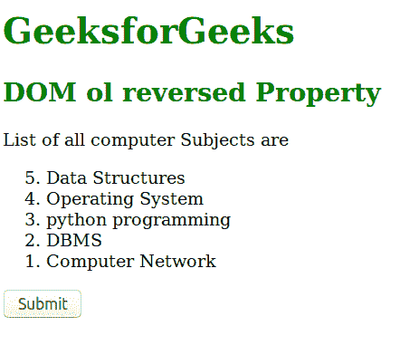
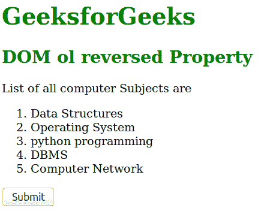
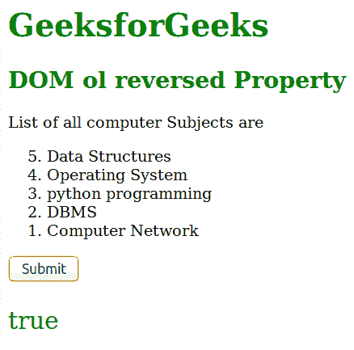

# HTML | DOM Ol 反转属性

> 原文:[https://www . geesforgeks . org/html-DOM-ol-reversed-property/](https://www.geeksforgeeks.org/html-dom-ol-reversed-property/)

**DOM Ol reversed** 属性用于设置或返回列表项是按降序(9，8，7，6，…)还是按升序(1，2，3，4…)排列。

**语法:**

*   它用于返回反转的属性。

```html
olObject.reversed

```

*   它用于设置反转属性。

```html
olObject.reversed = true|false

```

**属性值:**

*   **true:** 定义列表项按降序排列。
*   **false:** 定义列表项按升序排列。默认情况下，它设置为 false。

**返回值:**返回一个布尔值，代表列表项的降序或升序。

**示例-1:** 演示如何设置属性的 HTML 程序。

## 超文本标记语言

```html
<!DOCTYPE html>
<html>
    <head>
        <title>Dom ol reversed Property</title>
    </head>
    <body>
        <h1 style ="color:green;">
        GeeksforGeeks</h1>
        <h2 style="color:green;">
         DOM ol reversed Property
        </h2>

<p>List of all computer Subjects are</p>

        <ol id="GFG" reversed>
            <li>Data Structures</li>
            <li>Operating System</li>
            <li>python programming</li>
            <li>DBMS</LI>
            <li>Computer Network</li>
        </ol>
        <button onclick="myGeeks()">Submit</button>

        <!-- Script to set the order of list -->
        <script>
          function myGeeks()  {
            var x = document.getElementById("GFG").reversed = false;
          }
        </script>
    </body>
</html>                                
```

**输出:**
**点击按钮前:**



**点击按钮后:**



**示例-2 :** 说明如何返回属性的 HTML 程序。

## 超文本标记语言

```html
<!DOCTYPE html>
<html>
    <head>
        <title>Dom ol reversed Property</title>

    </head>
    <body>
        <h1 style ="color:green;">
        GeeksforGeeks
        </h1>
        <h2 style="color:green;">
         DOM ol reversed Property
        </h2>

<p>List of all computer Subjects are</p>

        <ol id="GFG" reversed>
            <li>Data Structures</li>
            <li>Operating System</li>
            <li>python programming</li>
            <li>DBMS</LI>
            <li>Computer Network</li>
        </ol>
        <button onclick="myGeeks()">Submit</button>
        <p id="sudo"
         style="font-size:25px;color:green;text-align:center;">
        </p>

        <!-- Script to print the order of list -->
        <script>
          function myGeeks()  {
            var x = document.getElementById("GFG").reversed;
            document.getElementById("sudo").innerHTML = x;
          }
        </script>
    </body>
</html>                                
```

**输出:**
**点击按钮前:**


**点击按钮后:**



**支持的浏览器:**支持的浏览器 *DOM ol reversed Property* 如下:

*   谷歌 Chrome
*   火狐浏览器
*   歌剧
*   Safari 6.0