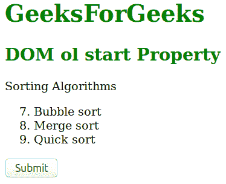
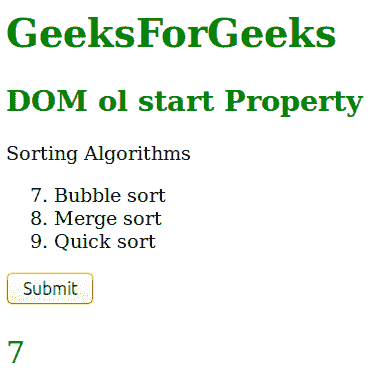
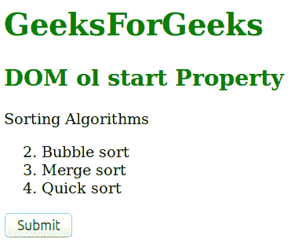
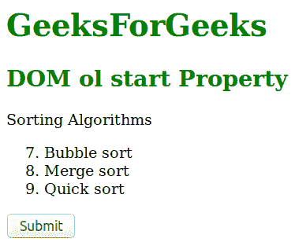

# HTML | DOM Ol 开始属性

> 原文:[https://www.geeksforgeeks.org/html-dom-ol-start-property/](https://www.geeksforgeeks.org/html-dom-ol-start-property/)

**DOM Ol start** 属性用于在有序列表中设置或返回 start 属性的值。HTML 中的开始属性用于指定单个列表项编号的开始值。它与有序列表一起使用。

**语法:**

1.  它用于返回 start 属性。

    ```html
    olObject.start
    ```

2.  It is used to Set the start property.

    ```html
    olObject.start = number
    ```

    **属性值**

    *   **编号:**定义一个起始值，代表有序列表中第一个列表项的起始值。

    **返回值:**返回一个字符串值，代表有序列表中第一个列表项的第一个值。
    **示例-1:** 说明如何返回属性的 HTML 程序。

    ```html
    <!DOCTYPE html> 
    <html> 
        <head> 
            <title>DOM ol start Property</title></title> 
        </head> 
        <body> 
            <h1 style="color:green;">
                GeeksForGeeks
               </h1> 
            <h2 style = "color: green;"> 
                DOM ol start Property 
            </h2> 

            <p>Sorting Algorithms</p> 

            <ol start="7" id="GFG"> 
                <li>Bubble sort</li> 
                <li>Merge sort</li> 
                <li>Quick sort</li> 
            </ol> 
          <button onclick="myGeeks()">Submit</button>    
          <p id="sudo" style="font-size:25px;color:green;">
          </p>

          <!-- Script to get the value of start property -->
          <script>
          function myGeeks()  {
          var x = document.getElementById("GFG").start; 
          document.getElementById("sudo").innerHTML = x;
          }
          </script>
        </body> 
    </html> 
    ```

    **输出:**
    **点击按钮前:**

    

    **点击按钮后:**

    

    **示例-2 :** 演示如何设置属性的 HTML 程序。

    ```html
    <!DOCTYPE html> 
    <html> 
        <head> 
            <title>DOM ol start Property</title></title> 
        </head> 
        <body> 
            <h1 style="color:green;">
                GeeksForGeeks
               </h1> 
            <h2 style = "color: green;"> 
                DOM ol start Property 
            </h2> 

            <p>Sorting Algorithms</p> 

            <ol start="2" id="GFG"> 
                <li>Bubble sort</li> 
                <li>Merge sort</li> 
                <li>Quick sort</li> 
            </ol> 
          <button onclick="myGeeks()">Submit</button>    

          <!-- Script to set the value of start property -->
          <script>
          function myGeeks()  {
          document.getElementById("GFG").start = "7"; 
          }
          </script>
        </body> 
    </html> 
    ```

    **输出:**
    **点击按钮前:**
    

    **点击按钮后:**
    

    **支持的浏览器:**T2 DOM ol start Property 支持的浏览器如下:

    *   谷歌 Chrome
    *   微软公司出品的 web 浏览器
    *   火狐浏览器
    *   歌剧
    *   旅行队