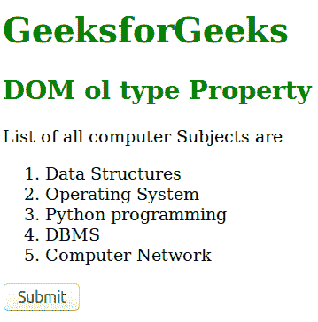
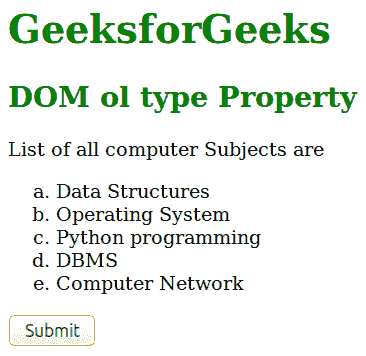
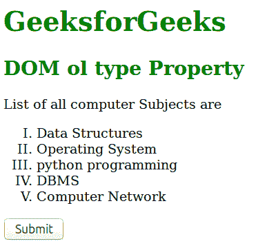
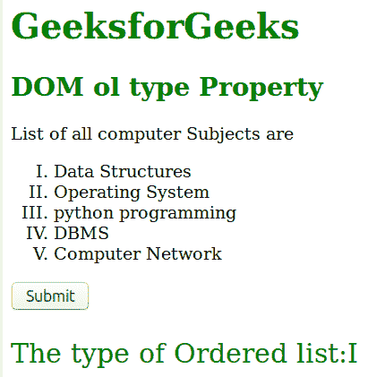

# HTML | DOM Ol 类型属性

> 原文:[https://www.geeksforgeeks.org/html-dom-ol-type-property/](https://www.geeksforgeeks.org/html-dom-ol-type-property/)

**DOM Ol 类型**属性用于设置或返回有序列表中的类型属性。该属性定义了您想要在数字、字母或罗马数字列表中的顺序类型(1、A、A、I 和 I)。

语法:。
**语法:**

*   它用于返回类型属性。

```html
olObject.type
```

*   它用于设置类型属性。

```html
olObject.type = "1|a|A|i|I"
```

**房产价值:**

*   **1:** 这是默认值。它以十进制数定义列表项。(1, 2, 3, 4 .).
*   **a:** 用字母顺序的小写字母定义列表项。(a、b、c、d……)
*   **A:** 用字母顺序的大写字母定义列表项。(甲、乙、丙、丁..)
*   **i:** 以小写罗马数字顺序定义列表项。(一、二、三、四、五、六……)
*   **I:** 以大写罗马数字顺序定义列表项。(一、二、三、四、五、六..)

**返回值:**返回一个字符串值，代表有序列表中使用的标记类型。
**示例-1:** 演示如何设置**类型**属性的 HTML 程序。

## 超文本标记语言

```html
<!DOCTYPE html>
<html>
    <head>
        <title>dom ol type Property</title>
    </head>
    <body>
        <h1 style ="color:green;">GeeksforGeeks</h1>
        <h2 style="color:green;">DOM ol type Property</h2>

<p>List of all computer Subjects are</p>

        <ol id="GFG">
            <li>Data Structures</li>
            <li>Operating System</li>
            <li>Python programming</li>
            <li>DBMS</LI>
            <li>Computer Network</li>
        </ol>
        <button onclick="myGeeks()">Submit</button>

        <!-- Script to set the type of list -->
        <script>
          function myGeeks()  {
            var x = document.getElementById("GFG").type = "a";
          }
        </script>
    </body>
</html>                                
```

**输出:**
**点击按钮前:**



**点击按钮后:**



**示例-2 :** 演示如何返回**类型**属性的 HTML 程序。

## 超文本标记语言

```html
<!DOCTYPE html>
<html>
    <head>
        <title>Dom ol type Property</title>
    </head>
    <body>
        <h1 style ="color:green;">GeeksforGeeks</h1>
        <h2 style="color:green;">DOM ol type Property</h2>

<p>List of all computer Subjects are</p>

        <ol id="GFG" type="I">
            <li>Data Structures</li>
            <li>Operating System</li>
            <li>python programming</li>
            <li>DBMS</li>
            <li>Computer Network</li>
        </ol>
        <button onclick="myGeeks()">Submit</button>
        <p id="sudo" style="font-size:25px;color:green;"></p>

        <!-- Script to get the type of list -->
        <script>
          function myGeeks()  {
            var x = document.getElementById("GFG").type;
            document.getElementById("sudo").innerHTML =
                        "The type of Ordered list:" + x;
          }
        </script>
    </body>
</html>                                
```

**输出:**
**点击按钮前:**



**点击按钮后:**



**支持的浏览器:**T2 DOM ol 类型属性支持的浏览器如下:

*   谷歌 Chrome
*   微软公司出品的 web 浏览器
*   火狐浏览器
*   歌剧
*   旅行队