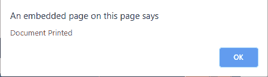

# HTML | DOM onafterprint 事件

> 原文:[https://www.geeksforgeeks.org/html-dom-onafterprint-event/](https://www.geeksforgeeks.org/html-dom-onafterprint-event/)

当网页开始打印或打印对话框关闭时，会出现 **DOM onafterprint 事件**。
**支持的标签**

*   **<体>**

**语法:**

*   **HTML:**

```html
<element onafterprint="myScript">
```

*   **JavaScript:**

```html
object.onafterprint = function(){myScript};
```

*   **在 JavaScript 中，使用 addEventListener()方法:**

```html
object.addEventListener("afterprint", myScript);
```

**例:**

## 超文本标记语言

```html
<!DOCTYPE html>
<html>

<head>
    <title>
        HTML | DOM onafterprint Event
    </title>
</head>

<body>
    <center>
        <h1 style="color:green">
            GeeksforGeeks
        </h1>

        <h2>DOM onafterprint Event</h2>

<p>
            <strong>Tip: </strong>Keyboard
            shortcuts Ctrl+P
        </p>

        <script>
            window.addEventListener("afterprint", myGeeks);

            function myGeeks() {
                alert("Document Printed");
            }
        </script>
    </center>
</body>

</html>   
```

**输出:**

*   **打印前:**


*   **打印后:**



**支持的浏览器:**T2 HTML DOM on afterprint 事件支持的浏览器如下:

*   谷歌 Chrome 63.0
*   微软公司出品的 web 浏览器
*   火狐浏览器