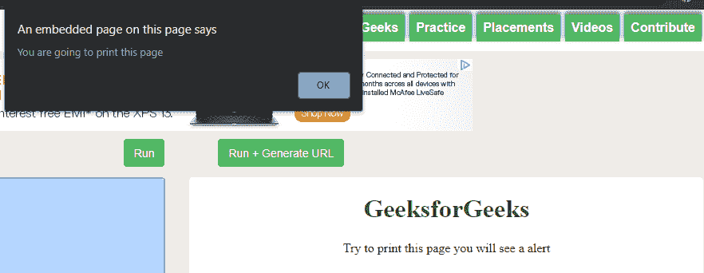

# HTML |DOM 非强制打印事件

> 哎哎哎:# t0]https://www . geeksforgeeks . org/html-DOM-onforrecint-event/

当用户发出打印页面的命令时，onbeforeprint 事件发生。就在打印页面之前，将显示一个对话框。onbeforeprint 事件与 onafterprint 事件相反。
**支持的标签**

*   **<体>**

**语法:**

*   **在 HTML 中:**

```html
<element onbeforeprint="myScript">
```

*   **在 JavaScript 中:**

```html
object.onbeforeprint = function(){myScript};
```

*   **在 JavaScript 中，使用 addEventListener()方法:**

```html
object.addEventListener("beforeprint", myScript);
```

以下示例说明了 HTML DOM 中的 onbeforeprint 事件:

*   **示例:**使用 HTML

## 超文本标记语言

```html
<!DOCTYPE html>
<!DOCTYPE html>
<html>

<body onbeforeprint="myFunction()">
    <center>
        <h1 style="color:green">
          GeeksforGeeks
      </h1>

<p>Try to print this page you will see a alert</p>

        <script>
            function myFunction() {
                alert("You are going to print this page");
            }
        </script>
    </center>
</body>

</html>
```

*   **输出:**
    **给出打印命令后:**



*   **示例:**使用 javascript

## 超文本标记语言

```html
<!DOCTYPE html>
<html>

<body>
    <center>
        <h1 style="color:green">
          GeeksforGeeks
      </h1>

<p>Try to print this page you will see a alert</p>

        <script>
            document.getElementsByTagName("BODY")[0].onbeforeprint = function() {
                myFunction()
            };

            function myFunction() {
                alert("You are going to print this page");
            }
        </script>
  </center>
</body>

</html>
```

*   **输出:**
    **给出打印命令后:**


*   **示例:**在 JavaScript 中，使用 addEventListener()方法:

## 超文本标记语言

```html
<!DOCTYPE html>
<html>

<body>
    <center>
        <h1 style="color:green">
          GeeksforGeeks
      </h1>

<p>Try to print this page you will see a alert</p>

        <script>
            window.addEventListener("beforeprint", myFunction);

            function myFunction() {
                alert("You are going to print this page");
            }
        </script>
    </center>
</body>

</html>
```

*   **输出:**
    **给出打印命令后:**


**支持的浏览器:**HTML DOM onbeforeprint 事件支持的浏览器如下:

*   谷歌 Chrome 63.0
*   微软公司出品的 web 浏览器
*   火狐浏览器