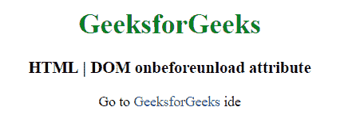
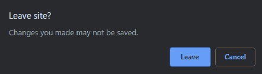

# html | DOM oneforly 事件

> 哎哎哎:# t0]https://www . geeksforgeeks . org/html-DOM-onfornlad-event/

onbeforeunload 事件在您单击文本链接或图片链接或任何类型的链接时发生，这些链接会将您带到一个新页面。此事件将显示一个确认对话框，通知用户是要留在页面上，还是离开当前页面继续下一个链接页面。无法删除对话框中的消息。

**语法:**

*   **在 HTML 中:**

```html
<element onbeforeunload="myScript">
```

*   **在 JavaScript 中:**

```html
object.onbeforeunload = function(){myScript};
```

*   **在 JavaScript 中，使用 addEventListener()方法:**

```html
object.addEventListener("beforeunload", myScript);
```

下面的例子说明了在 HTML DOM 中的 onbeforeunload 事件:

*   **示例:**使用 HTML

## 超文本标记语言

```html
<!DOCTYPE html>
<html>

<head>
    <title>HTML | DOM onbeforeunload attribute</title>
    <style>
        body {
            text-align: center;
        }

        h1 {
            color: green;
        }

        a {
            text-decoration: none;

        }
    </style>
</head>

<body onbeforeunload="return myFunction()">
    <h1>GeeksforGeeks</h1>
    <h3>HTML | DOM onbeforeunload attribute</h3>

<p>Go to
        <a href="https://ide.geeksforgeeks.org/">GeeksforGeeks </a>
    ide</p>

    <script>
        function myFunction() {
            return "This document is ready to load";
        }
    </script>
</body>

</html>
```

*   **输出:**
    **后加载代码:**



*   **点击文字链接后:**



*   **示例:**使用 JavaScript

## 超文本标记语言

```html
<!DOCTYPE html>
<html>

<head>
    <title>HTML | DOM onbeforeunload attribute</title>
    <style>
        body {
            text-align: center;
        }

        h1 {
            color: green;
        }

        a {
            text-decoration: none;
        }
    </style>
</head>

<body>
    <h1>GeeksforGeeks</h1>
    <h3>HTML | DOM onbeforeunload attribute</h3>

<p>Go to
        <a href="https://ide.geeksforgeeks.org/">GeeksforGeeks </a>
    ide</p>

    <script>
        window.onbeforeunload = function(event) {
            event.returnValue = "This document is ready to load";
        };
    </script>
</body>

</html>
```

*   **输出:**
    **后加载代码:**


*   **点击文字链接后:**


*   **示例:**在 JavaScript 中，使用 addEventListener()方法:

## 超文本标记语言

```html
<!DOCTYPE html>
<html>

<head>
    <title>HTML | DOM onbeforeunload attribute</title>
    <style>
        body {
            text-align: center;
        }

        h1 {
            color: green;
        }

        a {
            text-decoration: none;
        }
    </style>
</head>

<body>
    <h1>GeeksforGeeks</h1>
    <h3>HTML | DOM onbeforeunload attribute</h3>

<p>Go to
        <a href="https://ide.geeksforgeeks.org/">GeeksforGeeks </a>
    ide</p>

    <script>
        window.addEventListener("beforeunload", function(event) {
            event.returnValue = "This document is ready to load";
        });
    </script>
</body>

</html>
```

*   **输出:**
    **后加载代码:**


*   **点击文字链接后:**


**支持的浏览器:**

*   谷歌 Chrome
*   微软公司出品的 web 浏览器
*   火狐浏览器
*   旅行队
*   Opera 15.0