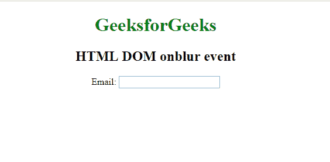
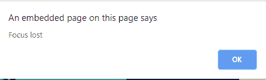

# HTML | DOM onblur 事件

> 原文:[https://www.geeksforgeeks.org/html-dom-onblur-event/](https://www.geeksforgeeks.org/html-dom-onblur-event/)

当对象失去焦点时，就会发生 HTML DOM on bulr 事件。on bulr 事件与 onfocus 事件相反。
on bulr 事件主要用于表单验证代码(例如，当用户离开表单字段时)。

**语法:**

**在 HTML 中:**

```html
<element onblur="myScript">
```

**在 JavaScript 中:**

```html
object.onblur = function(){myScript};
```

**在 JavaScript 中，使用 addEventListener()方法:**

```html
object.addEventListener("blur", myScript);
```

**示例:**使用 HTML

```html
<!DOCTYPE html>
<html>

<body>
    <center>
        <h1 style="color:green">
          GeeksforGeeks
      </h1>
        <h2>HTML DOM onblur event</h2> Email:
        <input type="email" id="email" onblur="myFunction()">

        <script>
            function myFunction() {
                alert("Focus lost");
            }
        </script>
    </center>
</body>

</html>
```

**输出:**



**示例:**在 JavaScript 中:

```html
<!DOCTYPE html>
<html>

<body>
    <center>
        <h1 style="color:green">
          GeeksforGeeks
      </h1>
        <h2>HTML DOM onblur event</h2>
        <input type="email" id="email">

        <script>
            document.getElementById("email").onblur = function() {
                myFunction()
            };

            function myFunction() {
                alert("Input field lost focus.");
            }
        </script>
    </center>
</body>

</html>
```

**输出:**


**示例:**在 JavaScript 中，使用 addEventListener()方法

```html
<!DOCTYPE html>
<html>

<body>
    <center>
        <h1 style="color:green">
          GeeksforGeeks
      </h1>
        <h2>HTML DOM onblur event</h2>
        <input type="email" id="email">

        <script>
            document.getElementById(
              "email").addEventListener("blur", myFunction);

            function myFunction() {
                alert("Input field lost focus.");
            }
        </script>
    </center>
</body>

</html>
```

**输出:**


**支持的浏览器:****HTML DOM on bulr Event**支持的浏览器如下:

*   谷歌 Chrome
*   微软公司出品的 web 浏览器
*   火狐浏览器
*   苹果 Safari
*   歌剧