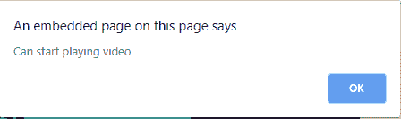
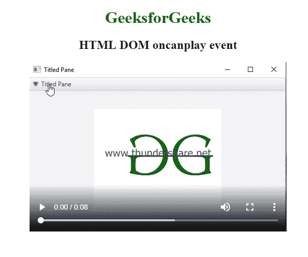

# HTML | DOM oncanplay 事件

> 原文:[https://www.geeksforgeeks.org/html-dom-oncanplay-event/](https://www.geeksforgeeks.org/html-dom-oncanplay-event/)

当指定的音频/视频被缓冲到足够开始时，就会发生 **HTML DOM oncanplay 事件**。
音频/视频加载过程中事件发生的顺序:

1.  onloadstart
2.  ondurationchange
3.  onloadedmetadata
4.  onloadeddata
5.  onprogress
6.  oncanplay
7.  oncanplaythrough

**支持的标签**

*   **<音频>**
*   **<视频>**

**语法:**
**在 HTML 中:**

```html
<element oncanplay="myScript">
```

**在 JavaScript 中:**

```html
object.oncanplay = function(){myScript};
```

**在 JavaScript 中，使用 addEventListener()方法:**

```html
object.addEventListener("canplay", myScript);
```

**示例:**使用 HTML

## 超文本标记语言

```html
<!DOCTYPE html>
<html>

<body>
    <center>
        <h1 style="color:green">
          GeeksforGeeks
      </h1>
        <h2>HTML DOM oncanplay event</h2>

        <video controls oncanplay="myFunction()">
            <source src="Geekfun.mp4" type="video/mp4">
        </video>

        <script>
            function myFunction() {
                alert("Can start playing video");
            }
        </script>
    </center>
</body>

</html>
```

**输出:**





**示例:**使用 JavaScript

## 超文本标记语言

```html
<!DOCTYPE html>
<html>

<body>
    <center>
        <h1 style="color:green">
          GeeksforGeeks
      </h1>
        <h2>HTML DOM oncanplay event</h2>

        <video controls id="myVideo">
            <source src="Geekfun.mp4" type="video/mp4">
        </video>

        <script>
            document.getElementById("myVideo").oncanplay = function() {
                myFunction()
            };

            function myFunction() {
                alert("Can start playing video");
            }
        </script>
    </center>
</body>

</html>
```

**输出:**


**示例:**在 JavaScript 中，使用 addEventListener()方法:

## 超文本标记语言

```html
<!DOCTYPE html>
<html>

<body>
    <center>
        <h1 style="color:green">
          GeeksforGeeks
      </h1>
        <h2>HTML DOM oncanplay event</h2>

        <video controls id="myVideo">
            <source src="Geekfun.mp4" type="video/mp4">
        </video>

        <script>
            document.getElementById(
              "myVideo").addEventListener(
              "canplay", myFunction);

            function myFunction() {
                alert("Can start playing video");
            }
        </script>
    </center>
</body>

</html>
```

**输出:**


**支持的浏览器:**T2 DOM oncanplay 事件支持的浏览器如下:

*   谷歌 Chrome
*   微软公司出品的 web 浏览器
*   火狐浏览器
*   苹果 Safari
*   歌剧