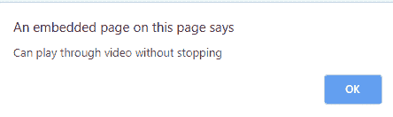

# HTML | DOM oncanplaythrough 事件

> 原文:[https://www . geeksforgeeks . org/html-DOM-oncanplay-event/](https://www.geeksforgeeks.org/html-dom-oncanplaythrough-event/)

**HTML DOM oncanplaythrough 事件**发生在指定媒体被缓冲并且浏览器估计它可以播放而不必停止的时候。
音频/视频加载过程中事件发生的顺序:

*   onloadstart
*   ondurationchange
*   onloadedmetadata
*   onloadeddata
*   onprogress
*   oncanplay
*   oncanplaythrough

**支持的标签**

*   **<音频>**
*   **<视频>**

**语法:**
**在 HTML 中:**

```html
<element oncanplaythrough="myScript">
```

**在 JavaScript 中:**

```html
object.oncanplaythrough = function(){myScript};
```

**在 JavaScript 中，使用 addEventListener()方法:**

```html
object.addEventListener("canplaythrough", myScript);
```

**示例:**使用 HTML

## 超文本标记语言

```html
<!DOCTYPE html>
<html>

<body>
    <center>
        <h1 style="color:green">
          GeeksforGeeks
      </h1>
        <h2>HTML DOM oncanplaythrough event</h2>
        <video controls oncanplaythrough="myFunction()">
            <source src="Geekfun.mp4" type="video/mp4">
        </video>

        <script>
            function myFunction() {
                alert("Can play through video without stopping");
            }
        </script>
    </center>
</body>

</html>
```

**输出:**



**示例:**使用 JavaScript

## 超文本标记语言

```html
<!DOCTYPE html>
<html>

<body>
    <center>
        <h1 style="color:green">
          GeeksforGeeks
      </h1>
        <h2>HTML DOM oncanplaythrough event</h2>
        <video controls id="myVideo">
            <source src="Geekfun.mp4" type="video/mp4">
        </video>

        <script>
            document.getElementById(
              "myVideo").oncanplaythrough = function() {
                myFunction()
            };

            function myFunction() {
                alert("Can play through video without stopping");
            }
        </script>
    </center>
</body>

</html>
```

**输出:**


**示例:**使用 addEventListener()方法:

## 超文本标记语言

```html
<!DOCTYPE html>
<html>

<body>
    <center>
        <h1 style="color:green">
          GeeksforGeeks
      </h1>
        <h2>HTML DOM oncanplaythrough event</h2>
        <video controls id="myVideo">
            <source src="Geekfun.mp4" type="video/mp4">
        </video>

        <script>
            document.getElementById(
            "myVideo").addEventListener("canplaythrough", myFunction);

            function myFunction() {
                alert("Can start playing video");
            }
        </script>
    </center>
</body>

</html>
```

**输出:**


**支持的浏览器:**T2 DOM oncanplay through 事件支持的浏览器如下:

*   谷歌 Chrome
*   微软公司出品的 web 浏览器
*   火狐浏览器
*   苹果 Safari
*   歌剧