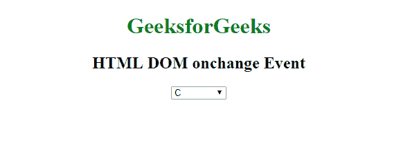
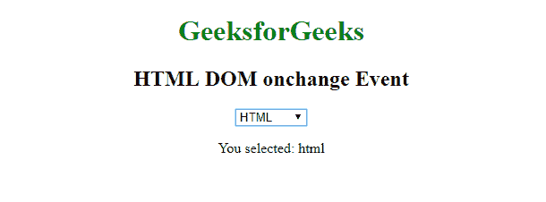
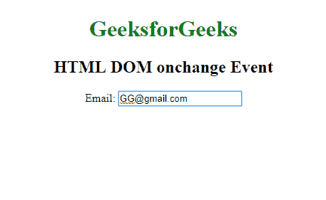
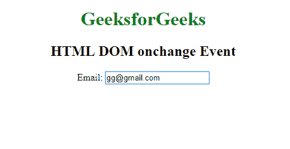

# HTML | DOM onchange 事件

> 哎哎哎:# t0]https://www . geeksforgeeks . org/html-DOM-onchange 事件/

当一个元素的值被改变时，就会发生 **HTML DOM onchange 事件**。当选中状态改变时，它也可以与单选按钮和复选框一起使用。

**注意:**此事件与 oninput 事件类似，但唯一的区别是 oninput 事件在元素的值更改后立即发生，而 onchange 则在元素失去焦点时发生。

**语法:**

**在 HTML 中:**

```html
<element onchange="myScript">
```

**在 JavaScript 中:**

```html
object.onchange = function(){myScript};
```

**在 JavaScript 中，使用 addEventListener()方法:**

```html
object.addEventListener("change", myScript);
```

**示例:**使用 HTML

```html
<!DOCTYPE html>
<html>

<body>
    <center>
        <h1 style="color:green">
          GeeksforGeeks
      </h1>
        <h2>HTML DOM onchange Event</h2>

        <select id="LangSelect" onchange="GFGfun()">
            <option value="c">C</option>
            <option value="java">JAVA</option>
            <option value="html">HTML</option>
            <option value="python">PYTHON</option>
        </select>

        <p id="demo"></p>

        <script>
            function GFGfun() {
                var x = document.getElementById("LangSelect").value;
                document.getElementById(
                    "demo").innerHTML = "You selected: " + x;
            }
        </script>
    </center>
</body>

</html>
```

**输出:**
**前:**

**后:**

**示例:**使用 JavaScript

```html
<!DOCTYPE html>
<html>

<body>
    <center>
        <h1 style="color:green">
          GeeksforGeeks
      </h1>
        <h2>HTML DOM onchange Event</h2> Email:
        <input type="email" id="email">

        <script>
            document.getElementById(
              "email").onchange = function() {
                GFGfun()
            };

            function GFGfun() {
                var x = document.getElementById("email");
                x.value = x.value.toLowerCase();
            }
        </script>

    </center>
</body>

</html>
```

**输出:**
**前:**

**后:**


**示例:**在 JavaScript 中，使用 addEventListener()方法:

```html
<!DOCTYPE html>
<html>

<body>
    <center>
        <h1 style="color:green">
          GeeksforGeeks
      </h1>
        <h2>HTML DOM onchange Event</h2> Email:
        <input type="email" id="email">

        <script>
            document.getElementById(
                "email").addEventListener(
              "change", GFGfun);

            function GFGfun() {
                var x = document.getElementById("email");
                x.value = x.value.toLowerCase();
            }
        </script>
    </center>

</body>

</html>
```

**前:**

**后:**


**支持的浏览器:****DOM onchange Event**支持的浏览器如下:

*   谷歌 Chrome
*   微软公司出品的 web 浏览器
*   火狐浏览器
*   苹果 Safari
*   歌剧