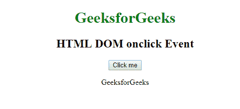
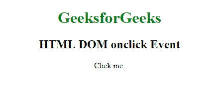
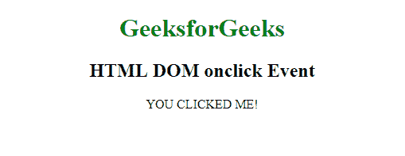

# HTML | DOM onclick 事件

> 原文:[https://www.geeksforgeeks.org/html-dom-onclick-event/](https://www.geeksforgeeks.org/html-dom-onclick-event/)

当用户点击一个元素时，就会出现 **HTML DOM onclick 事件**。

HTML DOM onclick 事件支持所有 HTML 元素，除了:

*   <iframe></li><li><meta/></li><li><param/></li><li><script/></li><li><style/></li><li><title/></li></ul>
<strong>语法:</strong>

<strong>在 HTML 中:</strong>
<pre>&lt;element onclick="myScript"&gt;</pre>
<strong>在 JavaScript 中:</strong>
<pre>object.onclick = function(){myScript};</pre>
<strong>在 JavaScript 中，使用 addEventListener()方法:</strong>
<pre>object.addEventListener("click", myScript);</pre>
<strong>示例 1: </strong>使用 HTML
<pre>&lt;!DOCTYPE html&gt; &lt;html&gt;    &lt;body&gt;     &lt;center&gt;         &lt;h1 style="color:green"&gt;           GeeksforGeeks       &lt;/h1&gt;         &lt;h2&gt;HTML DOM onclick Event&lt;/h2&gt;         &lt;button onclick="myFunction()"&gt;Click me&lt;/button&gt;            &lt;p id="demo"&gt;&lt;/p&gt;            &lt;script&gt;             function myFunction() {                 document.getElementById(                   "demo").innerHTML = "GeeksforGeeks";             }         &lt;/script&gt;     &lt;/center&gt; &lt;/body&gt;    &lt;/html&gt;</pre>
<strong>输出:</strong>   

<strong>示例 2: </strong>使用 JavaScript
<pre>&lt;!DOCTYPE html&gt; &lt;html&gt;    &lt;body&gt;     &lt;center&gt;         &lt;h1 style="color:green"&gt;           GeeksforGeeks       &lt;/h1&gt;         &lt;h2&gt;HTML DOM onclick Event&lt;/h2&gt;         &lt;p id="demo"&gt;Click me.&lt;/p&gt;            &lt;script&gt;             document.getElementById("demo").onclick = function() {                 GFGfun()             };                function GFGfun() {                 document.getElementById(                   "demo").innerHTML = "YOU CLICKED ME!";             }         &lt;/script&gt;     &lt;/center&gt; &lt;/body&gt;    &lt;/html&gt;</pre>
<strong>输出:</strong>   <b>前:</b>   

<b>之后:</b>   

<strong>示例 3: </strong>在 JavaScript 中，使用 addEventListener()方法:
<pre>&lt;!DOCTYPE html&gt; &lt;html&gt;    &lt;body&gt;     &lt;center&gt;         &lt;h1 style="color:green"&gt;           GeeksforGeeks       &lt;/h1&gt;         &lt;h2&gt;HTML DOM onclick Event&lt;/h2&gt;         &lt;p id="demo"&gt;Click me.&lt;/p&gt;            &lt;script&gt;             document.getElementById(               "demo").addEventListener("click", GFGfun);                function GFGfun() {                 document.getElementById(                   "demo").innerHTML = "YOU CLICKED ME!";             }         &lt;/script&gt;     &lt;/center&gt; &lt;/body&gt;    &lt;/html&gt;</pre>
<strong>输出:</strong>   <b>前:</b>   

<b>之后:</b>   

<strong>支持的浏览器:</strong><strong>DOM onclick 事件</strong>支持的浏览器如下:
<ul><li>谷歌 Chrome</li><li>微软公司出品的 web 浏览器</li><li>火狐浏览器</li><li>苹果 Safari</li><li>歌剧</li></ul>    </body></html></iframe>