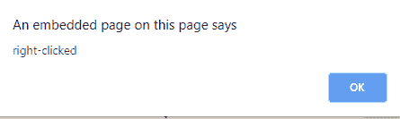

# html | DOM onccontext menu event

> 哎哎哎:# t0]https://www . geeksforgeeks . org/html-DOM-onccontext menu-event/

当右键单击一个元素以打开上下文菜单时，会出现 **HTML DOM oncontextmenu 事件**。

**注意:**所有浏览器都支持 oncontextmenu 事件，但 contextmenu 属性目前仅在 Firefox 中受支持。

**语法:**

**HTML:**

```html
<element oncontextmenu="myScript">
```

**JavaScript:**

```html
object.oncontextmenu = function(){myScript};
```

**在 JavaScript 中，使用 addEventListener()方法:**

```html
object.addEventListener("contextmenu", myScript);
```

**示例 1:** 使用 HTML

```html
<!DOCTYPE html>
<html>

<head>
    <style>
        div {
            background: green;
            border: 1px solid black;
            padding: 10px;
        }
    </style>
</head>

<body>
    <center>
        <h1 style="color:green">
          GeeksforGeeks
      </h1>
        <h2>HTML DOM oncontextmenu Event</h2>
        <div oncontextmenu="myFunction()" 
             contextmenu="mymenu">
            <p>Right-click inside the box
        </div>

        <script>
            function myFunction() {
                alert("right-clicked");
            }
        </script>
    </center>
</body>

</html>
```

**输出:**
**前:**

**后:**

**例 2:** 使用 JavaScript

```html
<!DOCTYPE html>
<html>

<head>
    <style>
        div {
            background: green;
            border: 1px solid black;
            padding: 10px;
        }
    </style>
</head>

<body>
    <center>
        <h1 style="color:green">
          GeeksforGeeks
      </h1>
        <h2>HTML DOM oncontextmenu Event</h2>
        <div id="myDIV" contextmenu="mymenu">
            <p>Right-click inside the box
        </div>

        <p id="try"></p>

        <script>
            document.getElementById(
              "myDIV").oncontextmenu = function() {
                GFGfun()
            };

            function GFGfun() {
                var gfg = document.getElementById("try");
                gfg.innerHTML = "right-clicked";
            }
        </script>
    </center>
</body>

</html>
```

**输出:**
**前:**

**后:**

**示例:**在 JavaScript 中，使用 addEventListener()方法:

```html
<!DOCTYPE html>
<html>

<head>
    <style>
        div {
            background: green;
            border: 1px solid black;
            padding: 10px;
        }
    </style>
</head>

<body>
    <center>
        <h1 style="color:green">
          GeeksforGeeks
      </h1>
        <h2>HTML DOM oncontextmenu Event</h2>
        <div id="myDIV" contextmenu="mymenu">
            <p>Right-click inside the box
        </div>

        <p id="try"></p>

        <script>
            document.getElementById(
                "myDIV").addEventListener("contextmenu", GFGfun);

            function GFGfun() {
                var gfg = document.getElementById("try");
                gfg.innerHTML = "right-clicked";
            }
        </script>
    </center>
</body>

</html>
```

**输出:**
**前:**

**后:**


**支持的浏览器:****DOM oncontext menu 事件**支持的浏览器如下:

*   谷歌 Chrome
*   微软公司出品的 web 浏览器
*   火狐浏览器
*   苹果 Safari
*   歌剧