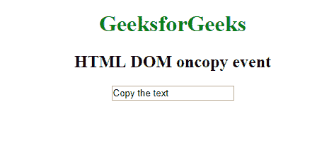
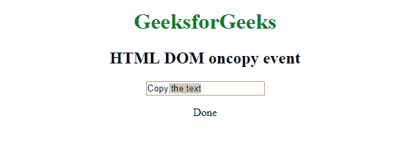
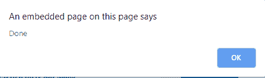

# HTML | DOM oncopy 事件

> 原文:[https://www.geeksforgeeks.org/html-dom-oncopy-event/](https://www.geeksforgeeks.org/html-dom-oncopy-event/)

当用户复制一个元素的内容时，就会出现 **HTML DOM oncopy 事件**。它也适用于使用元素创建的图像。多与**配合使用。
**注意:**复制一个元素的内容有三种方式:** 

1.  按 CTRL + C
2.  从浏览器的“编辑”菜单中选择“复制”
3.  右键单击以显示上下文菜单，并选择“复制”命令。

**支持的标签**

*   **支持所有 HTML 元素**

**语法:**
**在 HTML 中:**

```html
<element oncopy="myScript">
```

**在 JavaScript 中:**

```html
object.oncopy = function(){myScript};
```

**在 JavaScript 中，使用 addEventListener()方法:**

```html
object.addEventListener("copy", myScript);
```

**示例:**使用 HTML

## 超文本标记语言

```html
<!DOCTYPE html>
<html>

<head>
    <title>HTML DOM oncopy event</title>
</head>

<body>
    <center>
        <h1 style="color:green">GeeksforGeeks</h1>
        <h2>HTML DOM oncopy event</h2>
        <input type="text"
               oncopy="myFunction()"
               value="Copy the text">

        <p id="demo"></p>

        <script>
            function myFunction() {
                document.getElementById("demo").innerHTML = "Done"
            }
        </script>
    </center>
</body>

</html>
```

**输出:**
**前:**



**之后:**



**示例:**使用 JavaScript

## 超文本标记语言

```html
<!DOCTYPE html>
<html>

<head>
    <title>HTML DOM oncopy event</title>
</head>

<body>
    <center>
        <h1 style="color:green">GeeksforGeeks</h1>
        <h2>HTML DOM oncopy event</h2>
<input type="text" id="myInput" value="Copy the text">

<script>
document.getElementById("myInput").oncopy = function() {GFGfun()};

function GFGfun() {
  alert("Done");
}
</script>

</body>
</html>
```

**输出:**
**前:**


**之后:**



**示例:**在 JavaScript 中，使用 addEventListener()方法:

## 超文本标记语言

```html
<!DOCTYPE html>
<html>

<head>
    <title>HTML DOM oncopy event</title>
</head>

<body>
    <center>
        <h1 style="color:green">
          GeeksforGeeks
      </h1>
        <h2>HTML DOM oncopy event</h2>
        <input type="text"
               id="myInput"
               value="Copy the text">

        <script>
            document.getElementById(
              "myInput").addEventListener("copy", GFGfun);

            function GFGfun() {
                alert("Done");
            }
        </script>
    </center>
</body>

</html>
```

**输出:**
**前:**


**之后:**


**支持的浏览器:**T2 oncopy 事件支持的浏览器如下:

*   谷歌 Chrome
*   微软公司出品的 web 浏览器
*   火狐浏览器
*   苹果 Safari
*   歌剧