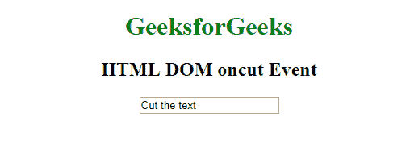
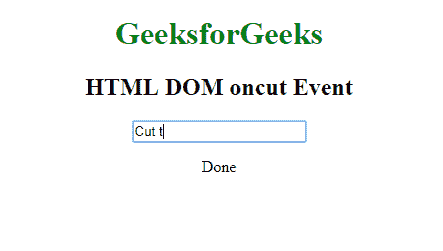
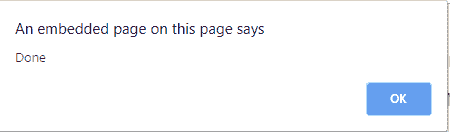

# HTML | DOM oncut 事件

> 原文:[https://www.geeksforgeeks.org/html-dom-oncut-event/](https://www.geeksforgeeks.org/html-dom-oncut-event/)

当用户剪切一个元素的内容时，就会出现 **HTML DOM oncut 事件**。oncut 事件主要用于带有**的元素。
**支持的标签****

*   **支持所有 HTML 元素。**

**语法:**
**在 HTML 中:**

```html
<element oncut="myScript">
```

**在 JavaScript 中:**

```html
object.oncut = function(){myScript};
```

**在 JavaScript 中，使用 addEventListener()方法:**

```html
object.addEventListener("cut", myScript);
```

**注意:**有三种方法可以剪切一个元素的内容:

1.  按 CTRL + X
2.  从浏览器的“编辑”菜单中选择“剪切”
3.  右键单击显示上下文菜单并选择“剪切”命令

**示例 1:** 使用 HTML

## 超文本标记语言

```html
<!DOCTYPE html>
<html>

<head>
    <title>HTML DOM oncut Event</title>
</head>

<body>
    <center>
        <h1 style="color:green">
          GeeksforGeeks
      </h1>
        <h2>HTML DOM oncut Event</h2>
        <input type="text"
               oncut="myFunction()"
               value="Cut the text">

        <p id="demo"></p>

        <script>
            function myFunction() {
                document.getElementById(
                  "demo").innerHTML = "Done";
            }
        </script>
    </center>
</body>

</html>
```

**输出:**
**前:**



**之后:**



**示例 2:** 使用 JavaScript

## 超文本标记语言

```html
<!DOCTYPE html>
<html>

<head>
    <title>HTML DOM oncut Event</title>
</head>

<body>
    <center>
        <h1 style="color:green">
          GeeksforGeeks
      </h1>
        <h2>HTML DOM oncut Event</h2>
        <input type="text"
               id="myInput"
               value="Cut the text">

        <script>
            document.getElementById("myInput").oncut = function() {
                GFGfun()
            };

            function GFGfun() {
                alert("Done");
            }
        </script>
    </center>
</body>

</html>
```

**输出:**
**前:**


**之后:**



**示例 3:** 在 JavaScript 中，使用 addEventListener()方法:

## 超文本标记语言

```html
<!DOCTYPE html>
<html>

<head>
    <title>HTML DOM oncut Event</title>
</head>

<body>
    <center>
        <h1 style="color:green">
          GeeksforGeeks
      </h1>
        <h2>HTML DOM oncut Event</h2>
        <input type="text"
               id="myInput"
               value="Cut the text">

        <script>
            document.getElementById(
              "myInput").addEventListener(
              "cut", GFGfun);

            function GFGfun() {
                alert("Done");
            }
        </script>
    </center>
</body>

</html>
```

**输出:**
**前:**


**之后:**


**支持的浏览器:****HTML DOM oncut 事件**支持的浏览器如下:

*   谷歌 Chrome
*   微软公司出品的 web 浏览器
*   火狐浏览器
*   苹果 Safari
*   歌剧