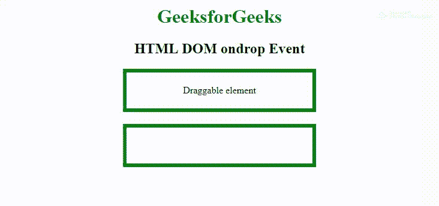

# html | DOM ondable event

> 原文:[https://www.geeksforgeeks.org/html-dom-ondragend-event/](https://www.geeksforgeeks.org/html-dom-ondragend-event/)

当可拖动元素完成拖动时，会出现 **HTML DOM ondragend 事件**。
在拖放操作的不同阶段使用和发生了一些事件:

*   **ondragstart:** 在开始拖动元素时出现。
*   **ondrag:** 在元素拖动时发生。
*   **ondragend:** 在元素拖动完成时出现。

*   **ondragenter:** 当被拖动的元素进入放置目标时发生。
*   **ondragover:** 当被拖动的元素在放置目标上时发生。
*   **软骨上:**当被拖动的元素从放置目标离开时发生。
*   **ondrop:** 当拖动的元素放在放置目标上时发生。

**支持的标签:**支持所有 HTML 元素。

**语法:**
**在 HTML 中:**

```html
<element ondragend="myScript">
```

**在 JavaScript 中:**

```html
object.ondragend = function(){myScript};
```

**在 JavaScript 中，使用 addEventListener()方法:**

```html
object.addEventListener("dragend", myScript);
```

**示例:**使用 HTML

## 超文本标记语言

```html
<!DOCTYPE HTML>
<html>

<head>
    <title>
        HTML DOM ondrop Event
    </title>
    <style>
        .droptarget {
            float: center;
            width: 300px;
            height: 50px;
            margin: 20px;
            padding: 5px;
            border: 6px solid green;
        }
    </style>
</head>

<body>
    <center>
        <h1 style="color:green">
        GeeksforGeeks
    </h1>
        <h2>HTML DOM ondrop Event</h2>

        <div class="droptarget"
             ondrop="Eledrop(event)"
             ondragover="EleallowDrop(event)">

            <p ondragstart="EledragStart(event)"
               ondragend="EledragEnd(event)"
               draggable="true"
               id="dragtarget">
              Draggable element
          </p>

        </div>

        <div class="droptarget"
             ondrop="Eledrop(event)"
             ondragover="EleallowDrop(event)">
      </div>

        <p id="demo"></p>

        <script>
            function EledragStart(event) {
                event.dataTransfer.setData("Text", event.target.id);
                document.getElementById(
                  "demo").innerHTML = "Dragging Started";
            }

            function EledragEnd(event) {
                document.getElementById(
                  "demo").innerHTML = "Dragging Finished";
            }

            function EleallowDrop(event) {
                event.preventDefault();
            }

            function Eledrop(event) {
                event.preventDefault();
                var data = event.dataTransfer.getData("Text");
                event.target.appendChild(document.getElementById(data));
            }
        </script>
  </center>
</body>

</html>
```

**输出**T2】



**示例:**使用 JavaScript

## 超文本标记语言

```html
<!DOCTYPE HTML>
<html>

<head>
    <title>
        HTML DOM ondrop Event
    </title>
    <style>
        .droptarget {
            float: center;
            width: 300px;
            height: 50px;
            margin: 20px;
            padding: 5px;
            border: 6px solid green;
        }
    </style>
</head>

<body>
    <center>
        <h1 style="color:green">
        GeeksforGeeks
    </h1>
        <h2>HTML DOM ondrop Event</h2>

        <div class="droptarget">
            <p draggable="true"
               id="dragtarget">
              Draggable Element
          </p>

        </div>

        <div class="droptarget"></div>

        <p id="demo"></p>

        <script>
            // Events fired on the drag target
            document.ondragstart = function(event) {
                event.dataTransfer.setData("Text", event.target.id);
                document.getElementById(
                  "demo").innerHTML = "Dragging Started";
            };

            document.ondragend = function(event) {
                document.getElementById(
                  "demo").innerHTML = "Dragging Finished";
            };

            // Events fired on the drop target
            document.ondragover = function(event) {
                event.preventDefault();
            };

            document.ondrop = function(event) {
                event.preventDefault();
                if (event.target.className == "droptarget") {
                    var data = event.dataTransfer.getData("Text");
                    event.target.appendChild(document.getElementById(data));
                }
            };
        </script>
    </center>
</body>

</html>
```

**输出**T2】


**例:**

## 超文本标记语言

```html
<!DOCTYPE HTML>
<html>

<head>
    <title>
        HTML DOM ondrop Event
    </title>
    <style>
        .droptarget {
            float: center;
            width: 300px;
            height: 50px;
            margin: 20px;
            padding: 5px;
            border: 6px solid green;
        }
    </style>
</head>

<body>
    <center>
        <h1 style="color:green">
        GeeksforGeeks
    </h1>
        <h2>HTML DOM ondrop Event</h2>
        <div class="droptarget">
            <p draggable="true"
               id="dragtarget">
              Draggable element
          </p>

        </div>

        <div class="droptarget"></div>

        <p id="demo"></p>

        <script>
            // Events fired on the drag target
            document.addEventListener("dragstart", function(event) {
                event.dataTransfer.setData("Text", event.target.id);
                document.getElementById(
                  "demo").innerHTML = "Dragging Started";
            });

            document.addEventListener("dragend", function(event) {
                document.getElementById(
                  "demo").innerHTML = "Dragging Finished";
            });

            // Events fired on the drop target
            document.addEventListener("dragover", function(event) {
                event.preventDefault();
            });

            document.addEventListener("drop", function(event) {
                event.preventDefault();
                if (event.target.className == "droptarget") {
                    var data = event.dataTransfer.getData("Text");
                    event.target.appendChild(document.getElementById(data));
                }
            });
        </script>
    </center>
</body>

</html>
```

**输出**T2】


**支持的浏览器:****HTML DOM on dragend Event**支持的浏览器如下:

*   谷歌 Chrome
*   微软公司出品的 web 浏览器
*   火狐浏览器
*   苹果 Safari
*   歌剧