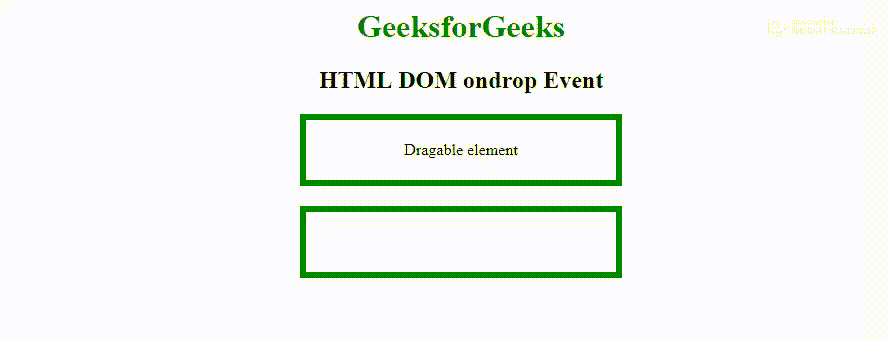

> 原文:[https://www.geeksforgeeks.org/html-dom-ondragstart-event/](https://www.geeksforgeeks.org/html-dom-ondragstart-event/)

当可拖动元素开始拖动时，会出现 **HTML DOM ondragstart 事件**。
在拖放操作的不同阶段使用和发生了一些事件:

向可拖动目标发射的事件:

*   **ondragstart:** 在开始拖动元素时出现。
*   **ondrag:** 在元素拖动时发生。
*   **ondragend:** 在元素拖动完成时出现。

在投放目标上触发的事件:

*   **ondragenter:** 当被拖动的元素进入放置目标时发生。
*   **ondragover:** 当被拖动的元素在放置目标上时发生。
*   **软骨上:**当被拖动的元素从放置目标离开时发生。
*   **ondrop:** 当拖动的元素放在放置目标上时发生。

**语法:**

*   **在 HTML 中:**

```html
<element ondragstart="myScript">
```

*   **在 JavaScript 中:**

```html
object.ondragstart = function(){myScript};
```

*   **在 JavaScript 中，使用 addEventListener()方法:**

```html
object.addEventListener("dragstart", myScript);
```

**注意:**默认情况下，链接和图像是可拖动的。
T3】例 1:

## 超文本标记语言

```html
<!DOCTYPE HTML>
<html>

<head>
    <title>HTML DOM ondrop Event</title>
    <style>
        .droptarget {
            float: center;
            width: 300px;
            height: 50px;
            margin: 20px;
            padding: 5px;
            border: 6px solid green;
        }
    </style>
</head>

<body>
    <center>
        <h1 style="color:green">
          GeeksforGeeks
      </h1>
        <h2>HTML DOM ondrop Event</h2>

        <div class="droptarget"
             ondrop="dropEle(event)"
             ondragover="allowDropEle(event)">

            <p ondragstart="dragStartEle(event)"
               draggable="true"
               id="dragtarget">
                Draggable element
            </p>

        </div>

        <div class="droptarget"
             ondrop="dropEle(event)"
             ondragover="allowDropEle(event)">
        </div>

        <p id="demo"></p>

        <script>
            function dragStartEle(event) {
                event.dataTransfer.setData(
                  "Text", event.target.id);

                document.getElementById(
                  "demo").innerHTML = "Dragging starts";
            }

            function allowDropEle(event) {
                event.preventDefault();
            }

            function dropEle(event) {
                event.preventDefault();
                var data =
                    event.dataTransfer.getData("Text");

                event.target.appendChild(
                  document.getElementById(data));

                document.getElementById("demo").innerHTML =
                  "Element dropped";
            }
        </script>
    </center>

</body>

</html>
```

**输出:**



**例 2:**

## 超文本标记语言

```html
<!DOCTYPE HTML>
<html>

<head>
    <title>
        HTML DOM ondrop Event
    </title>
    <style>
        .droptarget {
            float: center;
            width: 300px;
            height: 50px;
            margin: 20px;
            padding: 5px;
            border: 6px solid green;
        }
    </style>
</head>

<body>
    <center>
        <h1 style="color:green">
          GeeksforGeeks
      </h1>
        <h2>HTML DOM ondrop Event</h2>

        <div class="droptarget">
            <p draggable="true"
               id="dragtarget">
                Draggable element
          </p>

        </div>

        <div class="droptarget">
      </div>

        <p id="demo"></p>

        <script>
            // Event fired on the drag target
            document.ondragstart = function(event) {
                event.dataTransfer.setData("Text", event.target.id);
                document.getElementById("demo").innerHTML = "Dragging starts";
            };

            // Events fired on the drop target
            document.ondragover = function(event) {
                event.preventDefault();
            };

            document.ondrop = function(event) {
                event.preventDefault();
                var data = event.dataTransfer.getData("Text");
                event.target.appendChild(document.getElementById(data));
                document.getElementById("demo").innerHTML = "Element dropped";
            };
        </script>
    </center>
</body>

</html>
```

**输出:**


**例 3:**

## 超文本标记语言

```html
<!DOCTYPE HTML>
<html>

<head>
    <title>HTML DOM ondrop Event</title>
    <style>
        .droptarget {
            float: center;
            width: 300px;
            height: 50px;
            margin: 20px;
            padding: 5px;
            border: 6px solid green;
        }
    </style>
</head>

<body>
    <center>
        <h1 style="color:green">
          GeeksforGeeks
      </h1>
        <h2>HTML DOM ondrop Event</h2>

        <div class="droptarget">
            <p draggable="true" id="dragtarget">
              Draggable element</p>

        </div>

        <div class="droptarget"></div>

        <p id="demo"></p>

        <script>
            // Event fired on the drag target
            document.addEventListener("dragstart", function(event) {
                event.dataTransfer.setData("Text", event.target.id);
                document.getElementById("demo").innerHTML = "Dragging starts";
            });

            // Events fired on the drop target
            document.addEventListener("dragover", function(event) {
                event.preventDefault();
            });

            document.addEventListener("drop", function(event) {
                event.preventDefault();
                var data = event.dataTransfer.getData("Text");
                event.target.appendChild(document.getElementById(data));
                document.getElementById("demo").innerHTML = "Element dropped";
            });
        </script>
    </center>

</body>

</html>
```

**输出:**


**支持的浏览器:****HTML DOM ondragstart 事件**支持的浏览器如下:

*   谷歌 Chrome
*   微软公司出品的 web 浏览器
*   火狐浏览器
*   苹果 Safari
*   歌剧