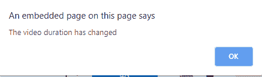

# HTML | DOM 波浪变化事件

> 原文:[https://www . geesforgeks . org/html-DOM-ondurationchange-event/](https://www.geeksforgeeks.org/html-dom-ondurationchange-event/)

当音频/视频持续时间改变时，会出现 **HTML DOM ondurationchange 事件**。
加载时，音频/视频的持续时间从“NaN”更改为音频/视频的实际持续时间。
在音频/视频加载过程中发生以下事件:

*   onloadstart
*   ondurationchange
*   onloadedmetadata
*   onloadeddata
*   onprogress
*   oncanplay
*   oncanplaythrough

**支持的标签:**

*   **<音频>**
*   **<视频>**

**语法:**

*   **在 HTML 中:**

```html
<element ondurationchange="myScript">
```

*   **在 JavaScript 中:**

```html
object.ondurationchange = function(){myScript};
```

*   **在 JavaScript 中，使用 addEventListener()方法:**

```html
object.addEventListener("durationchange", myScript);
```

**示例 1:** 使用 HTML

## 超文本标记语言

```html
<!DOCTYPE html>
<html>

<head>
    <title>
        HTML DOM ondurationchange Event
    </title>
</head>

<body>
    <center>
        <h1 style="color:green">GeeksforGeeks</h1>
        <h2>HTML DOM ondurationchange Event</h2>
        <video controls ondurationchange="GFGfun()">
            <source src="Canvas.move_.mp4"
                    type="video/mp4">
        </video>

        <script>
            function GFGfun() {
                alert("The video duration has changed");
            }
        </script>
    </center>
</body>

</html>
```

**输出:**



**示例 2:** 使用 JavaScript

## 超文本标记语言

```html
<!DOCTYPE html>
<html>

<head>
    <title>HTML DOM ondurationchange Event</title>
</head>

<body>
    <center>
        <h1 style="color:green">GeeksforGeeks</h1>
        <h2>HTML DOM ondurationchange Event</h2>
        <video controls ondurationchange="GFGfun()">
            <source src="Canvas.move_.mp4" type="video/mp4">
        </video>

        <script>
            document.getElementById("durVideo").ondurationchange = function() {
                GFGfun()
            };

            function GFGfun() {
                alert("The video duration has changed");
            }
        </script>
    </center>
</body>

</html>
```

**输出:**


**示例 3:** 使用 addEventListener()方法:

## 超文本标记语言

```html
<!DOCTYPE html>
<html>

<head>
    <title>
      HTML DOM ondurationchange Event
  </title>
</head>

<body>
    <center>
        <h1 style="color:green">GeeksforGeeks</h1>
        <h2>HTML DOM ondurationchange Event</h2>

        <video controls ondurationchange="GFGfun()">
            <source src="mov_bbb.mp4" type="video/mp4">
        </video>

        <script>
            document.getElementById(
              "durVideo").addEventListener("durationchange", GFGfun);

            function GFGfun() {
                alert("The video duration has changed");
            }
        </script>
    </center>
</body>

</html>
```

**输出:**


**支持的浏览器:****HTML DOM on durationchange Event**支持的浏览器如下:

*   谷歌 Chrome
*   微软公司出品的 web 浏览器
*   火狐浏览器
*   苹果 Safari
*   歌剧