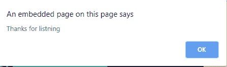
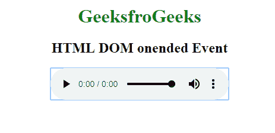
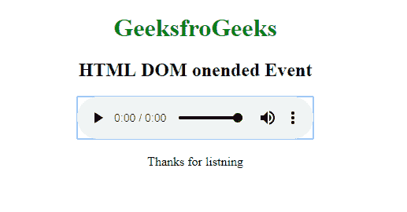

# HTML | DOM 合一事件

> 原文:[https://www.geeksforgeeks.org/html-dom-onended-event/](https://www.geeksforgeeks.org/html-dom-onended-event/)

音频/视频结束时出现 **HTML DOM 合一事件**。我们可以在这个活动中添加一些自定义消息，如“感谢观看”、“分享”等。
**支持的标签**

*   **<音频>**
*   **<视频>**

**语法:**
**在 HTML 中:**

```html
<element onended="myScript">
```

**在 JavaScript 中:**

```html
object.onended = function(){myScript};
```

**在 JavaScript 中，使用 addEventListener()方法:**

```html
object.addEventListener("ended", myScript);
```

**示例:**使用 HTML

## 超文本标记语言

```html
<!DOCTYPE html>
<html>

<body>
    <center>
        <h1 style="color:green">GeeksfroGeeks</h1>
        <h2>HTML DOM onended Event</h2>
        <audio controls onended="gfgFun()">
            <source src="beep.mp3" type="audio/mpeg">
        </audio>

        <script>
            function gfgFun() {
                alert("Thanks for listning");
            }
        </script>
    </center>
</body>

</html>               
```

**输出:**





**示例:**使用 JavaScript

## 超文本标记语言

```html
<!DOCTYPE html>
<html>

<body>
    <center>
        <h1 style="color:green">GeeksfroGeeks</h1>
        <h2>HTML DOM onended Event</h2>
        <audio id="audioId" controls>
            <source src="beep.mp3" type="audio/mpeg">
        </audio>

        <p id="try"></p>

        <script>
            document.getElementById(
                "audioId").onended = function() {
                gfgFun()
            };

            function gfgFun() {
                document.getElementById(
                    "try").innerHTML = "Thanks for listning";
            }
        </script>
    </center>
</body>

</html>
```

**输出:**



**示例:**使用 addEventListener()方法

## 超文本标记语言

```html
<!DOCTYPE html>
<html>

<body>
    <center>
        <h1 style="color:green">GeeksfroGeeks</h1>
        <h2>HTML DOM onended Event</h2>
        <audio id="audioId" controls>
            <source src="beep.mp3" type="audio/mpeg">
        </audio>

        <p id="demo"></p>

        <script>
            document.getElementById(
              "audioId").addEventListener("ended", gfgFun);

            function gfgFun() {
                document.getElementById(
                  "demo").innerHTML = "Thanks for listning";
            }
        </script>
    </center>
</body>

</html>
```

**输出:**


**支持的浏览器:****HTML DOM 统一事件**支持的浏览器如下:

*   谷歌 Chrome
*   Internet Explorer 9.0
*   火狐浏览器
*   苹果 Safari
*   歌剧