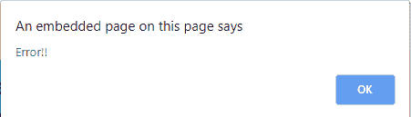
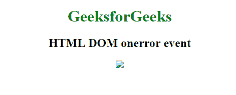
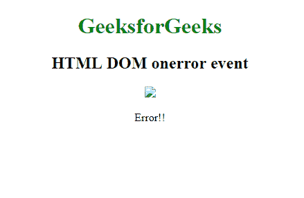

# html | DOM on error 事件

> 原文:[https://www.geeksforgeeks.org/html-dom-onerror-event/](https://www.geeksforgeeks.org/html-dom-onerror-event/)

加载外部文件时发生中断时，会触发**HTML DOM one error 事件**。
如果媒体加载过程受到某种干扰，会发生以下事件:

*   奥纳博特
*   一个提示
*   安装
*   onsuspend

**支持的标签**

*   <【img】>
*   **<输入 type="image" >**
*   **、<物体>**
*   **<链接>**
*   **<剧本>**

**语法:**

**在 HTML 中:**

```html
<element onerror="myScript">
```

**在 JavaScript 中:**

```html
object.onerror = function(){myScript};
```

**在 JavaScript 中，使用 addEventListener()方法:**

```html
object.addEventListener("error", myScript);
```

**示例:**使用 HTML

## 超文本标记语言

```html
<!DOCTYPE html>
<html>

<body>
    <center>
        <h1 style="color:green">GeeksforGeeks</h1>
        <h2>HTML DOM onerror event</h2>
        

        <script>
            function gfgFun() {
                alert('Error!!');
            }
        </script>
    </center>
</body>

</html>
```

**输出:**





**示例:**使用 JavaScript

## 超文本标记语言

```html
<!DOCTYPE html>
<html>

<body>
    <center>
        <h1 style="color:green">GeeksforGeeks</h1>
        <h2>HTML DOM onerror event</h2>

        

        <p id="try"></p>

        <script>
            document.getElementById(
              "logo").onerror = function() {
                myFunction()
            };

            function myFunction() {
                document.getElementById(
                  "try").innerHTML = "Error!!";
            }
        </script>
    </center>
</body>

</html>
```

**输出:**



**示例:**使用 addEventListener()方法

## 超文本标记语言

```html
<!DOCTYPE html>
<html>

<body>
    <center>
        <h1 style="color:green">GeeksforGeeks</h1>
        <h2>HTML DOM onerror event</h2>

        

        <p id="try"></p>

        <script>
            document.getElementById(
              "logo").addEventListener("error", myFunction);

            function myFunction() {
                document.getElementById(
                  "try").innerHTML = "Error!!";
            }
        </script>
    </center>
</body>

</html>
```

**输出:**


**支持的浏览器:****HTML DOM one error Event**支持的浏览器如下:

*   谷歌 Chrome
*   微软公司出品的 web 浏览器
*   火狐浏览器
*   苹果 Safari
*   歌剧