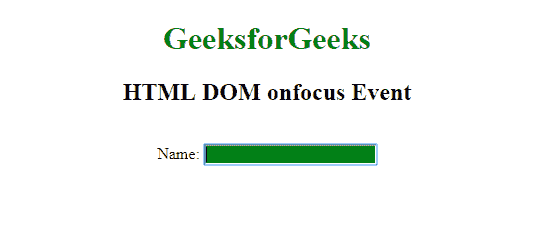

# HTML | DOM onfocus 事件

> 原文:[https://www.geeksforgeeks.org/html-dom-onfocus-event/](https://www.geeksforgeeks.org/html-dom-onfocus-event/)

当一个元素获得焦点时，就会出现 **HTML DOM onfocus 事件**。onfocus 事件多用于 **<输入>** 、 **<选择>** 、 **< a >** 。onfocus 事件与 on bulr 事件相反。

**HTML DOM onfocus 事件**支持所有 HTML 标签，除了:

*   <iframe></li><li><meta/></li><li><param/></li><li><script/></li><li><style/></li><li><title/></li></ul>
<strong>语法:</strong>
<ul><li><strong>在 HTML 中:</strong> <pre>&lt;element onfocus="myScript"&gt;</pre></li><li><strong>在 JavaScript 中:</strong> <pre>object.onfocus = function(){myScript};</pre></li><li><strong>在 JavaScript 中，使用 addEventListener()方法:</strong> <pre>object.addEventListener("focus", myScript);</pre></li></ul>
<strong>注:</strong><strong>onfocus</strong>事件不同于<strong>onfocus</strong>事件，因为<strong> onfocus </strong>事件不冒泡。

<strong>例 1: </strong>
<pre>&lt;!DOCTYPE html&gt; &lt;html&gt;    &lt;head&gt;     &lt;title&gt;       HTML DOM onfocus Event   &lt;/title&gt; &lt;/head&gt;    &lt;body&gt;     &lt;center&gt;         &lt;h1 style="color:green"&gt;           GeeksforGeeks       &lt;/h1&gt;         &lt;h2&gt;           HTML DOM onfocus Event       &lt;/h2&gt;         &lt;br&gt; Name:         &lt;input type="text"                 onfocus="geekfun(this)"&gt;         &lt;script&gt;             function geekfun(gfg) {                 gfg.style.background = "green";             }         &lt;/script&gt;   &lt;/center&gt; &lt;/body&gt;    &lt;/html&gt;</pre>
<strong>输出:</strong>   

<strong>例 2: </strong>
<pre>&lt;!DOCTYPE html&gt; &lt;html&gt;    &lt;head&gt;     &lt;title&gt;       HTML DOM onfocus Event   &lt;/title&gt; &lt;/head&gt;    &lt;body&gt;     &lt;center&gt;         &lt;h1 style="color:green"&gt;           GeeksforGeeks       &lt;/h1&gt;         &lt;h2&gt;HTML DOM onfocus Event&lt;/h2&gt;         &lt;br&gt; Name:         &lt;input type="text" id="fname"&gt;            &lt;script&gt;             document.getElementById(               "fname").onfocus = function() {                 geekfun()             };                function geekfun() {                 document.getElementById(                   "fname").style.backgroundColor =                   "green";             }         &lt;/script&gt;     &lt;/center&gt; &lt;/body&gt;    &lt;/html&gt;</pre>
<b>输出</b>   

<strong>例 3: </strong>
<pre>&lt;!DOCTYPE html&gt; &lt;html&gt;    &lt;head&gt;     &lt;title&gt;       HTML DOM onfocus Event   &lt;/title&gt; &lt;/head&gt;    &lt;body&gt;     &lt;center&gt;         &lt;h1 style="color:green"&gt;           GeeksforGeeks       &lt;/h1&gt;         &lt;h2&gt;HTML DOM onfocus Event&lt;/h2&gt;         &lt;br&gt; Name:         &lt;input type="text" id="fname"&gt;            &lt;script&gt;             document.getElementById(               "fname").addEventListener(               "focus", Geeksfun);                function Geeksfun() {                 document.getElementById(                   "fname").style.backgroundColor = "green";             }         &lt;/script&gt;     &lt;/center&gt; &lt;/body&gt;    &lt;/html&gt;</pre>
<strong>输出:</strong>   

<strong>支持的浏览器:</strong><strong>HTML DOM onfocus Event</strong>支持的浏览器如下:
<ul><li>谷歌 Chrome</li><li>微软公司出品的 web 浏览器</li><li>火狐浏览器</li><li>苹果 Safari</li><li>歌剧</li></ul>    </body></html></iframe>