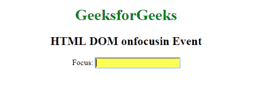

# HTML | DOM onfocusin 事件

> 原文:[https://www.geeksforgeeks.org/html-dom-onfocusin-event/](https://www.geeksforgeeks.org/html-dom-onfocusin-event/)

当一个元素获得焦点时，就会出现 **HTML DOM onfocusin 事件**。onfocusin 与 onfocus 相同，唯一的区别是 onfocus 事件不会冒泡。

如果想知道一个元素或其子元素是否获得焦点，应该使用 onfocusin 事件。
onfocus in 事件与 onfocusout 事件相反。

**注意:** Firefox 不支持 onfocusin 事件，但是在捕获监听器的帮助下，你可以发现一个元素的子元素是否获得了焦点。

**语法:**

**在 HTML 中:**

```html
<element onfocusin="myScript">
```

**在 JavaScript 中(可能无法像 Chrome、Safari 和 Opera 15+中预期的那样工作):**

```html
object.onfocusin = function(){myScript};
```

**在 JavaScript 中，使用 addEventListener()方法:**

```html
object.addEventListener("focusin", myScript);
```

**示例:**使用 HTML

```html
<!DOCTYPE html>
<html>

<body>
    <center>
        <h1 style="color:green">GeeksforGeeks</h1>
        <h2>HTML DOM onfocusin Event</h2> Focus:
        <input type="text" onfocusin="GFGfun(this)">

        <script>
            function GFGfun(foc) {
                foc.style.background = "yellow";
            }
        </script>
    </center>
</body>

</html>                
```

**输出:**


**示例:**使用 JavaScript

```html
<!DOCTYPE html>
<html>

<body>
    <center>
        <h1 style="color:green">GeeksforGeeks</h1>
        <h2>HTML DOM onfocusin Event</h2> Focus:
        <input type="text" id="fname">
        <script>
            document.getElementById(
              "fname").onfocusin = function() {
                myFunction()
            };

            function myFunction() {
                document.getElementById(
                  "fname").style.backgroundColor = "yellow";
            }
        </script>
    </center>
</body>

</html>
```

**输出:**


**示例:**使用 addEventListener()方法:

```html
<!DOCTYPE html>
<html>

<body>
    <center>
        <h1 style="color:green">GeeksforGeeks</h1>
        <h2>HTML DOM onfocusin Event</h2> Focus:
        <input type="text" id="fname">

        <script>
            document.getElementById(
              "fname").addEventListener("focusin", gfgFun);

            function gfgFun() {
                document.getElementById(
                  "fname").style.backgroundColor = "yellow";
            }
        </script>
    </center>
</body>

</html>
```

**输出:**


**支持的浏览器:****HTML DOM onfocusin Event**支持的浏览器如下:

*   谷歌 Chrome
*   微软公司出品的 web 浏览器
*   火狐 52
*   苹果 Safari
*   歌剧