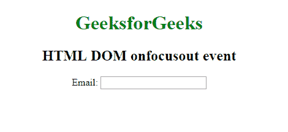
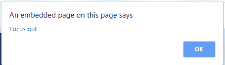

# HTML | DOM 聚焦事件

> 原文:[https://www.geeksforgeeks.org/html-dom-onfocusout-event/](https://www.geeksforgeeks.org/html-dom-onfocusout-event/)

当一个元素失去焦点时，就会出现 **HTML DOM onfocusout 事件**。onfocusout 与 on bulr 相同，唯一的区别是 on bulr 事件不会冒泡。
如果你想知道一个元素或者它的子元素是否失去焦点，你应该使用 onfocusout 事件。
onfocus in 事件与 onfocusout 事件相反。
**注意:**火狐不支持 onfocusout 事件，但是通过捕获监听器的帮助，你可以发现一个元素的子元素是否失去焦点。
**支持的标签:支持所有 HTML 元素，除了:**

*   **T2>基地**
*   **<【bdo】>**
*   **<【br】>**
*   **<头像>**
*   **< html >**
*   **< iframe >**
*   **< 当 >**
*   **<停止>**
*   **<剧本>**
*   **<风格>**
*   **T2**东>

语法:
**HTML 中:**

```html
<element onfocusout="myScript">
```

**在 JavaScript 中(可能不会像 Chrome、Safari 和 Opera 15+中预期的那样工作):**

```html
object.onfocusout = function(){myScript};
```

**在 JavaScript 中，使用 addEventListener()方法:**

```html
object.addEventListener("focusout", myScript);
```

**示例:**使用 HTML

## 超文本标记语言

```html
<!DOCTYPE html>
<html>

<body>
    <center>
        <h1 style="color:green">GeeksforGeeks</h1>
        <h2>HTML DOM onfocusout event </h2> Email:
        <input type="email" id="email" onfocusout="gfgFun()">

        <script>
            function gfgFun() {
                var x = document.getElementById("email");
                alert("Focus out");
            }
        </script>
    </center>
</body>

</html>
```

**输出:**





**示例:**使用 JavaScript

## 超文本标记语言

```html
<!DOCTYPE html>
<html>

<body>

    <center>
        <h1 style="color:green">GeeksforGeeks</h1>
        <h2>HTML DOM onfocusout event </h2> Email:
        <input type="email" id="email">

        <script>
            document.getElementById(
              "email").onfocusout = function() {
                gfgFun()
            };

            function gfgFun() {
                alert("Focus out");
            }
        </script>
    </center>
</body>

</html>
```

**输出:**


**示例:**使用 addEventListener()方法:

## 超文本标记语言

```html
<!DOCTYPE html>
<html>

<body>
    <center>
        <h1 style="color:green">GeeksforGeeks</h1>
        <h2>HTML DOM onfocusout event </h2>
      Email: <input type="email" id="email">

        <script>
            document.getElementById(
              "email").addEventListener("focusout", gfgFun);

            function gfgFun() {
                alert("Input field lost focus.");
            }
        </script>
    </center>
</body>

</html>
```

**输出:**


**支持的浏览器:****HTML DOM onfocus out 事件**支持的浏览器如下:

*   谷歌 Chrome
*   微软公司出品的 web 浏览器
*   Firefox 52.0
*   苹果 Safari
*   歌剧