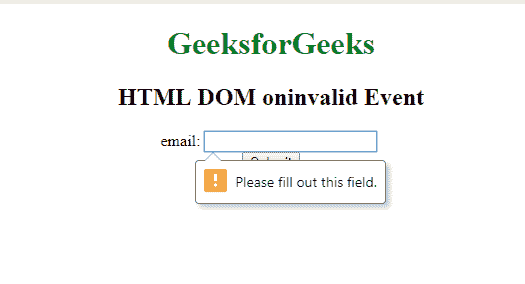

# html | DOM on valid event

> 哎哎哎:# t0]https://www . geeksforgeeks . org/html-DOM-in valid 事件/

当我们提交一个无效的元素时，就会出现 **HTML DOM oninvalid 事件**。例如，输入字段是可提交的，并且设置了必需的属性，那么如果该字段为空，则该属性无效。

**语法:**

*   **在 HTML 中:**

    ```html
    <element oninvalid="myScript">
    ```

*   **在 JavaScript 中:**

    ```html
    object.oninvalid = function(){myScript};
    ```

*   **在 JavaScript 中，使用 addEventListener()方法:**

    ```html
    object.addEventListener("invalid", myScript);
    ```

**示例 1:** 使用 HTML。

```html
<!DOCTYPE html>
<html>

<head>
    <title>
      HTML DOM oninvalid Event
  </title>
</head>

<body>
    <center>
        <h1 style="color:green">
          GeeksforGeeks
      </h1>
        <h2>
          HTML DOM oninvalid Event
      </h2>
        <form>
            email:
            <input type="email"
                   oninvalid=""
                   name="email" 
                   required>
            <br>
            <input type="submit"
                   value="Submit">
        </form>
    </center>
</body>

</html>
```

**输出:**


**示例 2:** 使用 JavaScript。

```html
<!DOCTYPE html>
<html>

<head>
    <title>
        HTML DOM oninvalid Event
    </title>
</head>

<body>
    <center>
        <h1 style="color:green">
          GeeksforGeeks
      </h1>
        <h2>
          HTML DOM oninvalid Event
      </h2>
        <form>
            Email:
            <input type="email" 
                   id="emailid"
                   name="email" 
                   required>
            <br>
            <input type="submit" 
                   value="Submit">
        </form>

        <script>
            document.getElementById(
              "emailid").oninvalid = function() {
                (GFGfun)
            };

            function GFGfun() {
                alert("Please fill out the required fields.");
            }
        </script>
    </center>
</body>

</html>
```

**输出:**


**示例 3:** 使用 addEventListener()方法:。

```html
<!DOCTYPE html>
<html>

<head>
    <title>
        HTML DOM oninvalid Event
    </title>
</head>

<body>
    <center>
        <h1 style="color:green">
          GeeksforGeeks
      </h1>
        <h2>
          HTML DOM oninvalid Event
      </h2>

        <form>
            Email:
            <input type="email" 
                   id="emailid"
                   name="email"
                   required>
            <br>
            <input type="submit"
                   value="Submit">
        </form>

        <script>
            document.getElementById(
                "emailid").addEventListener(
                "invalid", GFGfun);

            function GFGfun() {
                alert(
                    "Please fill out the required fields.");
            }
        </script>
    </center>
</body>

</html>
```

**输出:**
**前:**

**后:**


**支持的浏览器:**无效事件上 **HTML DOM 支持的浏览器如下:**

*   谷歌 Chrome
*   Internet Explorer 10.0
*   火狐浏览器
*   苹果 Safari
*   歌剧