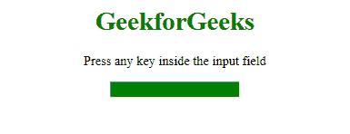
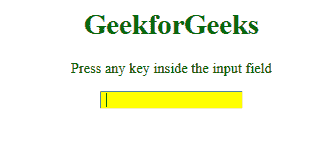

# HTML | DOM onkeyup 事件

> 原文:[https://www.geeksforgeeks.org/html-dom-onkeyup-event/](https://www.geeksforgeeks.org/html-dom-onkeyup-event/)

HTML 中的 **DOM onkeyup 事件**发生在用户按下一个键后释放的时候。

与 onkeyup 事件相关的事件顺序:

*   叔叔家
*   基普
*   上基乌普

**支持的 HTML 标签:**所有 HTML 元素，除了:

*   <iframe></li><li><meta/></li><li><param/></li><li><script/></li><li><style/></li><li><title/></li></ul>
<strong>语法:</strong>
<ul><li><strong>在 HTML 中:</strong> <pre>&lt;element onkeyup="myScript"&gt;</pre></li><li><strong>在 JavaScript 中:</strong> <pre> object.onkeyup = function(){myScript};</pre></li><li><strong>在 JavaScript 中，使用 addEventListener()方法:</strong> <pre>object.addEventListener("keyup", myScript);</pre></li></ul>
<strong>示例:</strong>使用 addEventListener()方法打开事件
<pre>&lt;!DOCTYPE html&gt; &lt;html&gt;    &lt;head&gt;     &lt;title&gt;       HTML DOM onkeyup Event   &lt;/title&gt; &lt;/head&gt;    &lt;body&gt;     &lt;center&gt;         &lt;h1 style="color:green"&gt;           GeekforGeeks       &lt;/h1&gt;         &lt;p&gt;           Press any key inside the input field       &lt;/p&gt;            &lt;input type="text"                 id="inputField"                 style="background-color:green"&gt;            &lt;script&gt;             document.getElementById(               "inputField").addEventListener(               "keyup", GFGFun);                function GFGFun() {                 document.getElementById(                   "inputField").style.backgroundColor =                    "yellow";                }         &lt;/script&gt;     &lt;/center&gt; &lt;/body&gt;    &lt;/html&gt;</pre>
<strong>输出:</strong>   <strong>前:</strong>   

<strong>之后:</strong>   

<strong>支持的浏览器:</strong><strong>HTML DOM onkey up 事件</strong>支持的浏览器如下:
<ul><li>谷歌 Chrome</li><li>微软公司出品的 web 浏览器</li><li>火狐浏览器</li><li>苹果 Safari</li><li>歌剧</li></ul>    </body></html></iframe>