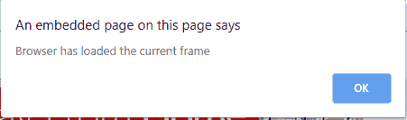

# html | DOM onload data event

> 哎哎哎::1230【https://www . geeksforgeeks . org/html-DOM-onload data-event/中

HTML 中的 **DOM onloadeddata 事件**发生在加载了当前帧数据，但下一帧的数据不足以播放音频/视频时。

音频/视频加载过程中发生的事件:

*   onloadstart
*   ondurationchange
*   onloadedmetadata
*   onloadeddata
*   onprogress
*   oncanplay
*   oncanplaythrough

**支持的 HTML 标签:**

**语法:**

*   **在 HTML 中:**

    ```html
    <element onloadeddata="myScript">
    ```

*   **在 JavaScript 中:**

    ```html
    object.onloadeddata = function(){myScript};
    ```

*   **在 JavaScript 中，使用 addEventListener()方法:**

    ```html
    object.addEventListener("loadeddata", myScript);
    ```

**示例:**在 JavaScript 中，使用 **addEventListener()** 方法

```html
<!DOCTYPE html>
<html>

<head>
    <title>
      HTML DOM onloadeddata Event
  </title>
</head>

<body>
    <center>
        <h1 style="color:green">
          GeeksforGeeks
      </h1>
        <h2>
          HTML DOM onloadeddata Event
      </h2>
        <video controls id="VideoId">
            <source src=
"https://media.geeksforgeeks.org/wp-content/uploads/20190705202742/Disabling-Tabs.mp4" 
                    type="video/mp4">
        </video>

        <script>
            document.getElementById(
              "VideoId").addEventListener(
              "loadeddata", GFGFun);

            function GFGFun() {
                alert("Browser has loaded the current frame");
            }
        </script>
    </center>
</body>

</html>
```

**输出:**




**支持的浏览器:****HTML DOM onloaded data 事件**支持的浏览器如下:

*   谷歌 Chrome
*   微软公司出品的 web 浏览器
*   火狐浏览器
*   苹果 Safari
*   歌剧