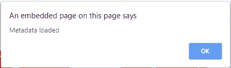

# html | DOM onload data event

> 原文:[https://www . geesforgeks . org/html-DOM-onloaded metadata-event/](https://www.geeksforgeeks.org/html-dom-onloadedmetadata-event/)

当为指定的音频/视频加载元数据时，会出现 HTML 中的 **onloadedmetadata 事件**。

音频/视频加载过程中发生的事件:

*   onloadstart
*   ondurationchange
*   onloadedmetadata
*   onloadeddata
*   onprogress
*   oncanplay
*   oncanplaythrough

**语法:**

*   **在 HTML 中:**

    ```html
    <element onloadedmetadata="myScript">
    ```

*   **在 JavaScript 中:**

    ```html
    object.onloadedmetadata = function(){myScript};
    ```

*   **在 JavaScript 中，使用 addEventListener()方法:**

    ```html
    object.addEventListener("loadedmetadata", myScript);
    ```

**示例:**在 JavaScript 中，使用 addEventListener()方法

```html
<!DOCTYPE html>
<html>

<head>
    <title>
        HTML DOM onloadeddata Event
    </title>
</head>

<body>
    <center>
        <h1 style="color:green">
          GeeksforGeeks
      </h1>
        <h2>
          HTML DOM onloadedmetadata Event
      </h2>
        <video controls id="VideoId">
            <source src=
"https://media.geeksforgeeks.org/wp-content/uploads/20190705202742/Disabling-Tabs.mp4" 
                    type="video/mp4">
        </video>

        <script>
            document.getElementById(
              "VideoId").addEventListener(
              "loadedmetadata", GFGFun);

            function GFGFun() {
                alert("Metadata loaded");
            }
        </script>
    </center>
</body>

</html>
```

**输出**




**支持的浏览器:****HTML DOM onloaded metadata 事件**支持的浏览器如下:

*   谷歌 Chrome
*   微软公司出品的 web 浏览器
*   火狐浏览器
*   苹果 Safari
*   歌剧