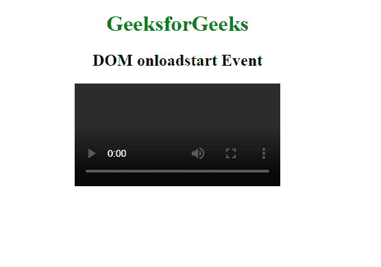
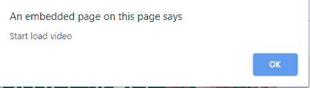

# HTML | DOM onloadstart 事件

> 原文:[https://www.geeksforgeeks.org/html-dom-onloadstart-event/](https://www.geeksforgeeks.org/html-dom-onloadstart-event/)

当指定音频/视频的加载过程开始时，会出现 **HTML DOM onloadstart 事件**。

音频/视频加载过程中发生的事件:

*   onloadstart
*   ondurationchange
*   onloadedmetadata
*   onloadeddata
*   onprogress
*   oncanplay
*   oncanplaythrough

**语法:**

*   **在 HTML 中:**

    ```html
    <element onloadstart="myScript">
    ```

*   **在 JavaScript 中:**

    ```html
    object.onloadstart = function(){myScript};
    ```

*   **在 JavaScript 中，使用 addEventListener()方法:**

    ```html
    object.addEventListener("loadstart", myScript);
    ```

**示例:**

```html
<!DOCTYPE html>
<html>

<head>
    <title>
      HTML DOM loadstar event
  </title>
</head>

<body>
    <center>
        <h1 style="color:green">
          GeeksforGeeks
      </h1>
        <h2>DOM loadstar event</h2>
        <video controls id="VidId">
            <source src="video.mp4"
                    type="video/mp4">
        </video>

        <script>
            document.getElementById(
              "VidId").addEventListener(
              "loadstart", GFGFun);

            function GFGFun() {
                alert("Start the load video");
            }
        </script>
    </center>
</body>

</html>
```

**输出:**




**支持的浏览器:****HTML DOM onloadstart 事件**支持的浏览器如下:

*   谷歌 Chrome
*   微软公司出品的 web 浏览器
*   火狐浏览器
*   苹果 Safari
*   歌剧