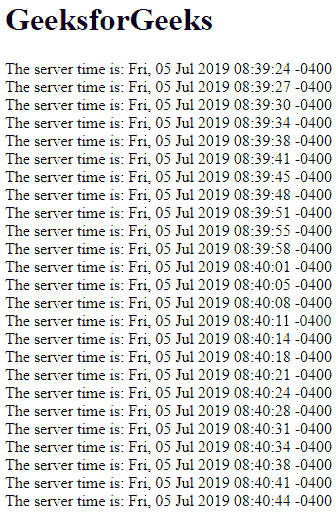
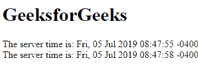

# HTML | DOM onmessage Event

> 原文:[https://www.geeksforgeeks.org/html-dom-onmessage-event/](https://www.geeksforgeeks.org/html-dom-onmessage-event/)

HTML DOM 中的 **onmessage Event** 用于对象通过事件源接收到一些消息时。

*消息事件*的事件对象支持以下方案:

*   **数据:**它包含存在于其中的实际消息。
*   **原点:**包含调用事件的文档的 URL。
*   **lastEventId:** 它作为消息流中发现的最后一条消息的描述性属性。

**注意:**Internet Explorer 不支持服务器发送的事件。

**语法:**

*   ```html
    object.onmessage = function(){myScript}; 
    ```

*   使用 addEventListener()方法

    ```html
    object.addEventListener("message", myScript);
    ```

**例 1:**

```html
<!DOCTYPE html>
<html>

<head>
    <title>
        HTML DOM onmessage Event
    </title>
</head>

<body>
    <h1 id="gfg"></h1>
    <div id="geeks"></div>

    <!--Main Function-->
    <script>
        if (typeof(EventSource) !== "undefined") {
            var source = new EventSource("/html/demo_sse.php");
            source.onopen = function() {
                document.getElementById("gfg").innerHTML =
                                               "GeeksforGeeks";
            };

            source.onmessage = function(event) {
                document.getElementById("geeks").innerHTML += 
                                           event.data + "<br>";
            };

        }
        else {
            document.getElementById("geeks").innerHTML = 
                                    "browser does not support";
        }
    </script>
</body>

</html>
```

**输出:**


**示例 2:** 使用 addEventListener()方法

```html
<!DOCTYPE html>
<html>

<head>
    <title>
        HTML DOM onmessage Event
    </title>
</head>

<body>
    <h1 id="gfg"></h1>
    <div id="geeks"></div>

    <!--main Function-->
    <script>
        if (typeof(EventSource) !== "undefined") {
            var source = new EventSource("/html/demo_sse.php");
            source.addEventListener("open", function() {
                document.getElementById("gfg").innerHTML =
                                               "GeeksforGeeks";
            });

            source.addEventListener("message", function(event) {
                document.getElementById("geeks").innerHTML += 
                                           event.data + "<br>";
            });

        } else {
            document.getElementById("geeks").innerHTML = 
                             "Your browser does not supported";
        }
    </script>

</body>

</html>
```

**输出:**


**支持的浏览器:**on message Event 支持的浏览器如下:

*   谷歌 Chrome 9.0
*   Mozilla Firefox 6.0
*   苹果 Safari 5.0
*   Opera 11.0