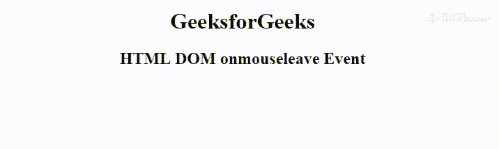

# HTML | DOM on mouse elevate Event

> 原文:[https://www.geeksforgeeks.org/html-dom-onmouseleave-event/](https://www.geeksforgeeks.org/html-dom-onmouseleave-event/)

当鼠标指针移出一个元素时，就会出现 HTML 中的 **DOM onmouseleave 事件**。这个事件与**上一个**事件相反。
本次活动类似于**上的**活动。
**支持的标签:支持所有 HTML 元素，除了:**

*   **T2>基地**
*   **<【bdo】>**
*   **<【br】>**
*   **<头像>**
*   **< html >**
*   **< iframe >**
*   **< 当 >**
*   **<停止>**
*   **<剧本>**
*   **<风格>**
*   **<称号>**

**语法:**

*   **在 HTML 中:**

```html
<element onmouseleave="myScript">
```

*   **在 JavaScript 中:**

```html
object.onmouseleave = function(){myScript};
```

*   **在 JavaScript 中，使用 addEventListener()方法:**

```html
object.addEventListener("mouseleave", myScript);
```

**示例:**使用 addEventListener()方法

## 超文本标记语言

```html
<!DOCTYPE html>
<html>

<head>
    <title>
        HTML DOM onmouseenter Event
    </title>
</head>

<body>
    <center>
        <h1 id="demo">
          GeeksforGeeks
      </h1>
        <h2>
          HTML DOM onmouseleave Event
      </h2>
    </center>
    <script>
        document.getElementById(
          "demo").addEventListener(
          "mouseenter", enter);

        document.getElementById(
          "demo").addEventListener(
          "mouseleave", leave);

        function enter() {
            document.getElementById(
              "demo").style.color = "yellow";
        }

        function leave() {
            document.getElementById(
              "demo").style.color = "green";
        }
    </script>

</body>

</html>
```

**输出:**



**支持的浏览器:****HTML DOM on mouse elevate Event**支持的浏览器如下:

*   谷歌 Chrome 30.0
*   Internet Explorer 5.5
*   火狐浏览器
*   苹果 Safari 6.1
*   歌剧 11.5