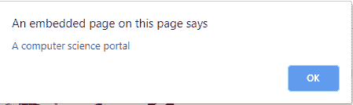

# html | DOM onmoemove event

> 哎哎哎:# t0]https://www . geeksforgeeks . org/html-DOM-onouemove-event/

当指针在一个元素上移动时，就会发生 HTML 中的 **DOM onmousemove 事件**。
**支持的标签:支持所有 HTML 元素，除了:**

*   <iframe></li><li><meta/></li><li><param/></li><li><script/></li><li><style/></li><li><title/></li></ul>
<strong>语法:</strong>  
<ul><li><strong>在 HTML 中:</strong>  </li></ul><pre>&lt;element onmousemove="myScript"&gt;</pre><ul><li><strong>在 JavaScript 中:</strong>  </li></ul><pre>object.onmousemove = function(){myScript};</pre><ul><li><strong>在 JavaScript 中，使用 addEventListener()方法:</strong>  </li></ul><pre>object.addEventListener("mousemove", myScript);</pre>
<strong>示例:</strong>使用 addEventListener()方法 

<h2 class="tabtitle">超文本标记语言</h2>
<pre>&lt;!DOCTYPE html&gt; &lt;html&gt;   &lt;head&gt;     &lt;title&gt;         HTML DOM onmousemove Event     &lt;/title&gt; &lt;/head&gt;   &lt;body&gt;     &lt;center&gt;           &lt;h1 id="eleID"&gt;GeeksforGeeks&lt;/h1&gt;           &lt;p id="demo"&gt;&lt;/p&gt;             &lt;script&gt;             document.getElementById(               "eleID").addEventListener(               "mousemove", function(event) {                 GFGfun(event);             });               function GFGfun(event) {                 alert("A computer science portal")             }         &lt;/script&gt;     &lt;/center&gt; &lt;/body&gt;   &lt;/html&gt;</pre>

<strong>输出:</strong>   <strong>前移:</strong>  

<strong>后移:</strong>  

<strong>支持的浏览器:</strong><strong>DOM onmousemove 事件</strong>支持的浏览器如下: 
<ul><li>谷歌 Chrome</li><li>微软公司出品的 web 浏览器</li><li>火狐浏览器</li><li>苹果 Safari</li><li>歌剧</li></ul>
 
 </body></html></iframe>