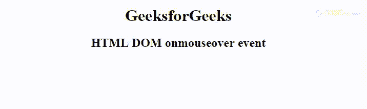

# HTML | DOM onmouseover 事件

> 原文:[https://www.geeksforgeeks.org/html-dom-onmouseover-event/](https://www.geeksforgeeks.org/html-dom-onmouseover-event/)

当鼠标指针移动到一个元素或其子元素上时，就会发生 HTML 中的 **DOM onmouseover 事件**。
**支持的标签:支持所有 HTML 元素，除了:**

*   **T2>基地**
*   **<【bdo】>**
*   **<【br】>**
*   **<头像>**
*   **< html >**
*   **< iframe >**
*   **< 当 >**
*   **<停止>**
*   **<剧本>**
*   **<风格>**
*   **<称号>**

**语法:**

*   **在 HTML 中:**

```html
<element onmouseover="myScript">
```

*   **在 JavaScript 中:**

```html
object.onmouseover = function(){myScript};
```

*   **在 JavaScript 中，使用 addEventListener()方法:**

```html
object.addEventListener("mouseover", myScript);
```

**例:**

## 超文本标记语言

```html
<!DOCTYPE html>
<html>

<head>
    <title>
      DOM onmouseover event
  </title>
</head>

<body>
    <center>

        <h1 id="hID">
          GeeksforGeeks
      </h1>
        <h2>
          HTML DOM onmouseover event
      </h2>

        <script>
            document.getElementById(
              "hID").addEventListener(
              "mouseover", over);

            document.getElementById(
              "hID").addEventListener(
              "mouseout", out);

            function over() {
                document.getElementById(
                  "hID").style.color = "green";
            }

            function out() {
                document.getElementById(
                  "hID").style.color = "black";
            }
        </script>
    </center>
</body>

</html>
```

**输出:**



**支持的浏览器:****HTML DOM onmouseover 事件**支持的浏览器如下:

*   谷歌 Chrome
*   微软公司出品的 web 浏览器
*   火狐浏览器
*   苹果 Safari
*   歌剧