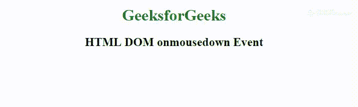

# HTML | DOM onmouseup 事件

> 原文:[https://www.geeksforgeeks.org/html-dom-onmouseup-event/](https://www.geeksforgeeks.org/html-dom-onmouseup-event/)

当鼠标在一个元素上按下按钮时，就会发生**事件。
**相关事件为左键:**** 

*   onmousedown
*   是 mouseup
*   onclick

**相关事件为右键:**

*   onmousedown
*   是 mouseup
*   oncontextmenu

**支持的标签:支持所有 HTML 元素，除了:**

*   **T2>基地**
*   **<【bdo】>**
*   **<【br】>**
*   **<头像>**
*   **< html >**
*   **< iframe >**
*   **< 当 >**
*   **<停止>**
*   **<剧本>**
*   **<风格>**
*   **<称号>**

**语法:**

*   **在 HTML 中:**

```html
<element onmouseup="myScript">
```

*   **在 JavaScript 中:**

```html
object.onmouseup = function(){myScript};
```

*   **在 JavaScript 中，使用 addEventListener()方法:**

```html
object.addEventListener("mouseup", myScript);
```

**例:**

## 超文本标记语言

```html
<!DOCTYPE html>
<html>

<head>
    <title>
      HTML DOM onmousedown Event
  </title>
</head>

<body>
    <center>
        <h1 style="color:green">
          GeeksforGeeks
      </h1>
        <h2 id="try">
          HTML DOM onmousedown Event
      </h2>

        <script>
            document.getElementById(
              "try").addEventListener(
              "mousedown", btnpressed);

            document.getElementById(
              "try").addEventListener(
              "mouseup", btnup);

            function btnpressed() {
                document.getElementById(
                  "try").innerHTML = "Button Pressed.";
            }

            function btnup() {
                document.getElementById(
                  "try").innerHTML = "Button Released.";
            }
        </script>
    </center>
</body>

</html>
```

**输出:**



**支持的浏览器:**T2 HTML DOM onmouseup 事件支持的浏览器如下:

*   谷歌 Chrome
*   微软公司出品的 web 浏览器
*   火狐浏览器
*   苹果 Safari
*   歌剧