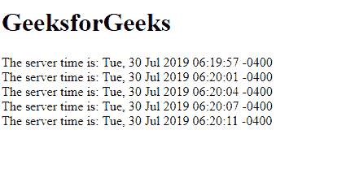

# html | DOM onon 事件

> 原文:[https://www.geeksforgeeks.org/html-dom-onopen-event/](https://www.geeksforgeeks.org/html-dom-onopen-event/)

**DOM onopen 事件**发生在与事件源的开放连接上。

**相关事件:**

*   **消息:**收到消息。
*   **onerror:** 出现问题。

**语法:**

*   **使用 JavaScript:**

    ```html
    object.onopen = function(){myScript};
    ```

*   **使用 addEventListener()方法:**

    ```html
    object.addEventListener("open", myScript); 
    ```

**示例:**使用 **addEventListener()** 方法

```html
<!DOCTYPE html>
<html>

<head>
    <title>
        HTML DOM onopen Event
    </title>
</head>

<body>

    <h1 id="gfg"></h1>
    <div id="geeks"></div>

    <script>
        if (typeof(EventSource) !== "undefined") {
            var source = new EventSource("/html/demo_sse.php");
            source.addEventListener("open", function() {
                document.getElementById("gfg").innerHTML = 
                  "GeeksforGeeks";
            });

            source.addEventListener("message", function(event) {
                document.getElementById("geeks").innerHTML +=
                  event.data + "<br>";
            });

        } else {
            document.getElementById("gfg").innerHTML = 
              "Browser does not support";
        }
    </script>

</body>

</html>
```

**输出:**


**支持的浏览器:****HTML DOM on open Event**支持的浏览器如下:

*   谷歌 Chrome 9.0
*   Firefox 6.0
*   苹果 Safari 5.0
*   Opera 11.0