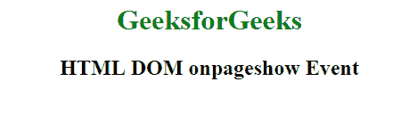

# html | DOM on stage 事件

> 哎哎哎:# t0]https://www . geeksforgeeks . org/html-DOM-onpdiahow-event/

HTML 中的 **DOM onpageshow 事件**发生在用户导航网页时。
从缓存加载页面时不会发生 **onload 事件**，每次加载页面时都会发生 **onpageshow** 事件，否则这两个事件是相似的。
**支持的标签**

*   **<体>**

**语法:**

*   **在 HTML 中:**

```html
<element onpageshow="myScript">
```

*   **在 JavaScript 中:**

```html
object.onpageshow = function(){myScript};
```

*   **在 JavaScript 中，使用 addEventListener()方法:**

```html
object.addEventListener("pageshow", myScript); 
```

**示例:**使用 JavaScript

## 超文本标记语言

```html
<!DOCTYPE html>
<html>

<head>
    <title>
        HTML DOM onpageshow Event
    </title>
</head>

<body>
    <center>
        <h1 id="hID"
            style="color:green">
      </h1>

        <h2>HTML DOM onpageshow Event</h2>
    </center>

    <script>
        document.getElementsByTagName(
          "BODY")[0].onpageshow = function() {
            GFGfun()
        };

        function GFGfun() {
            document.getElementById("hID").innerHTML =
              "GeeksforGeeks";
        };
    </script>

</body>

</html>
```

**输出:**



**示例:**使用 addEventListener()方法

## 超文本标记语言

```html
<!DOCTYPE html>
<html>

<head>
    <title>
        HTML DOM onpageshow Event
    </title>
</head>

<body>

    <center>
        <h1 id="hID" style="color:green">
      </h1>
        <h2>HTML DOM onpageshow Event</h2>
    </center>

    <script>
        window.addEventListener("pageshow", Geeks);

        function Geeks() {
            document.getElementById("hID").innerHTML =
                "GeeksforGeeks";
        }
    </script>

</body>

</html>
```

**输出:**


**支持的浏览器:**页面展示事件中 **HTML DOM 支持的浏览器如下:** 

*   谷歌 Chrome
*   Internet Explorer 11.0
*   火狐浏览器
*   苹果 Safari 5.0
*   歌剧