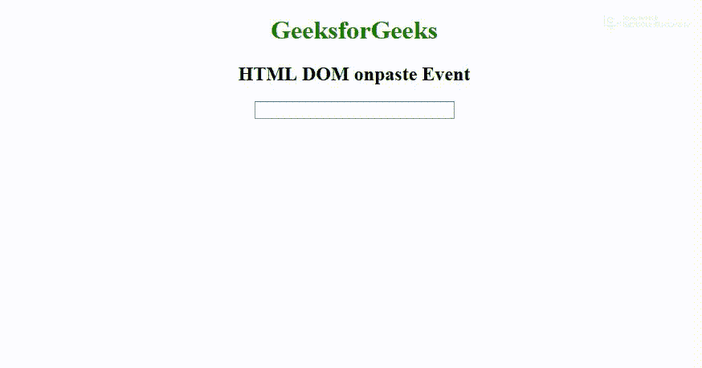

# HTML | DOM onpaste 事件

> 原文:[https://www.geeksforgeeks.org/html-dom-onpaste-event/](https://www.geeksforgeeks.org/html-dom-onpaste-event/)

当一些内容粘贴到一个元素中时，就会出现 **HTML DOM onpaste 事件**。这个事件对每个元素都有效，就像在 **< p >元素**中一样。如果 **contenteditable** 设置为 true，那么我们可以在 **< p >元素**中粘贴内容。
输入元素**中最常用的 HTML DOM onpaste 事件。
**支持的标签****

它支持所有的 HTML 元素。

**语法:**

*   **在 HTML 中:**

```html
<element onpaste="myScript">
```

*   **在 JavaScript 中:**

```html
object.onpaste = function(){myScript};
```

*   **在 JavaScript 中，使用 addEventListener()方法:**

```html
object.addEventListener("paste", myScript);
```

**示例:**使用 addEventListener()方法。

## 超文本标记语言

```html
<!DOCTYPE html>
<html>

<head>
    <title>
      HTML DOM onpaste Event
  </title>
</head>

<body>
    <center>
        <h1 style="color:green">
          GeeksforGeeks
      </h1>
        <h2>HTML DOM onpaste Event</h2>

        <input type="text" id="inputID" size="37">

        <script>
            document.getElementById(
                "inputID").addEventListener("paste", GFGfun);

            function GFGfun() {
                alert("Text pasted");
            }
        </script>
    </center>
</body>

</html>
```

**输出:**



**支持的浏览器:****HTML DOM on paste Event**支持的浏览器如下:

*   谷歌 Chrome
*   微软公司出品的 web 浏览器
*   火狐浏览器
*   苹果 Safari
*   歌剧