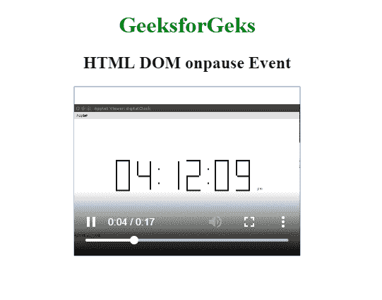
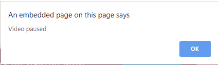

# HTML | DOM onpause Event

> 原文:[https://www.geeksforgeeks.org/html-dom-onpause-event/](https://www.geeksforgeeks.org/html-dom-onpause-event/)

暂停音频/视频时会出现 **DOM onpause 事件**。音频/视频可以由用户暂停，也可以通过编程暂停。
**支持的标签**

*   **<音频>**
*   **<视频>**

**语法:**

*   **在 HTML 中:**

```html
<element onpause="myScript">
```

*   **在 JavaScript 中:**

```html
object.onpause = function(){myScript};
```

*   **在 JavaScript 中，使用 addEventListener()方法:**

```html
object.addEventListener("pause", myScript);
```

**示例:**使用 addEventListener()方法

## 超文本标记语言

```html
<!DOCTYPE html>
<html>

<head>
    <title>
        HTML DOM onpause Event
    </title>
</head>

<body>
    <center>
        <h1 style="color:green">
          GeeksforGeks
      </h1>
        <h2>HTML DOM onpause Event</h2>

        <video controls id="vidID"
               width="320" height="240">

            <source src=
"https://media.geeksforgeeks.org/wp-content/uploads/20190401140735/g4g2.mp4"
                    type="video/mp4">
        </video>

        <script>
            document.getElementById(
              "vidID").addEventListener(
              "pause", GFGfun);

            function GFGfun() {
                alert("Video paused");
            }
        </script>
    </center>
</body>

</html>
```

**输出:**

*   **暂停前:**



*   **暂停后:**



**支持的浏览器:**因事件而被 **HTML DOM 支持的浏览器如下:** 

*   谷歌 Chrome
*   Internet Explorer 9.0
*   火狐浏览器
*   苹果 Safari
*   歌剧