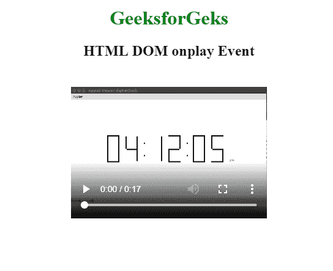
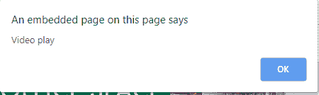

# HTML | DOM onplay 事件

> 原文:[https://www.geeksforgeeks.org/html-dom-onplay-event/](https://www.geeksforgeeks.org/html-dom-onplay-event/)

播放音频/视频时出现 **DOM onplay 事件**。音频/视频可以由用户播放，也可以通过编程方式播放。
**支持的标签**

*   **<音频>**
*   **<视频>**

**语法:**

*   **在 HTML 中:**

```html
<element onplay="myScript">
```

*   **在 JavaScript 中:**

```html
object.onplay = function(){myScript};
```

*   **在 JavaScript 中，使用 addEventListener()方法:**

```html
object.addEventListener("play", myScript);
```

**示例:**使用 addEventListener()方法

## 超文本标记语言

```html
<!DOCTYPE html>
<html>

<head>
    <title>
        HTML DOM onplay Event
    </title>
</head>

<body>
    <center>
        <h1 style="color:green">
          GeeksforGeks
      </h1>
        <h2>HTML DOM onplay Event</h2>

        <video controls id="vidID"
               width="320" height="240">
            <source src=
"https://media.geeksforgeeks.org/wp-content/uploads/20190401140735/g4g2.mp4"
                    type="video/mp4">
        </video>

        <script>
            document.getElementById(
              "vidID").addEventListener("play", GFGfun);

            function GFGfun() {
                alert("Video play");
            }
        </script>
    </center>
</body>

</html>
```

**输出:**

*   **上场前:**



*   **赛后:**T2】



**支持的浏览器:****HTML DOM onplay Event**支持的浏览器如下:

*   谷歌 Chrome
*   Internet Explorer 9.0
*   火狐浏览器
*   苹果 Safari
*   歌剧