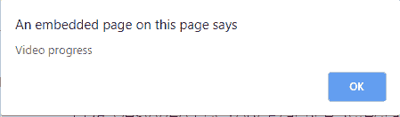
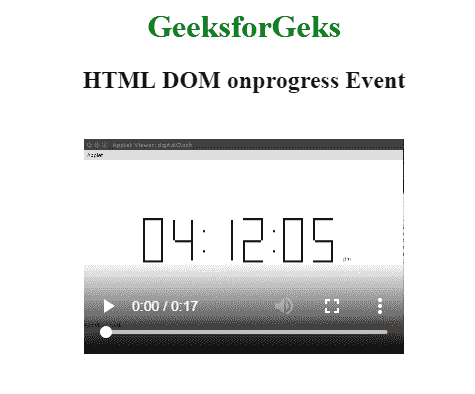

# HTML | DOM onprogress 事件

> 原文:[https://www.geeksforgeeks.org/html-dom-onprogress-event/](https://www.geeksforgeeks.org/html-dom-onprogress-event/)

当浏览器正在下载指定的音频/视频时，会出现 HTML 中的 **DOM onprogress 事件**。
音频/视频加载过程中发生的事件:

1.  onloadstart
2.  ondurationchange
3.  onloadedmetadata
4.  onloadeddata
5.  onprogress
6.  oncanplay
7.  oncanplaythrough

**支持的标签**

**语法:**

*   **在 HTML 中:**

```html
<element onprogress="myScript">
```

*   **在 JavaScript 中:**

```html
object.onprogress = function(){myScript};
```

*   **在 JavaScript 中，使用 addEventListener()方法:**

```html
object.addEventListener("progress", myScript);
```

**示例:**使用 addEventListener()方法

## 超文本标记语言

```html
<!DOCTYPE html>
<html>

<head>
    <title>
        HTML DOM onprogress Event
    </title>
</head>

<body>
    <center>
        <h1 style="color:green">
          GeeksforGeks
      </h1>
        <h2>
          HTML DOM onprogress Event
      </h2>

        <video controls id="vidID"
               width="320" height="240">
            <source src=
"https://media.geeksforgeeks.org/wp-content/uploads/20190401140735/g4g2.mp4"
                    type="video/mp4">
        </video>

        <script>
            document.getElementById(
              "vidID").addEventListener("progress", GFGfun);

            function GFGfun() {
                alert("Video progress");
            }
        </script>
    </center>
</body>

</html>
```

**输出:**

*   **之前:**



*   **之后:**



**支持的浏览器:****HTML DOM on progress Event**支持的浏览器如下:

*   谷歌 Chrome
*   Internet Explorer 9.0
*   火狐浏览器
*   苹果 Safari
*   歌剧