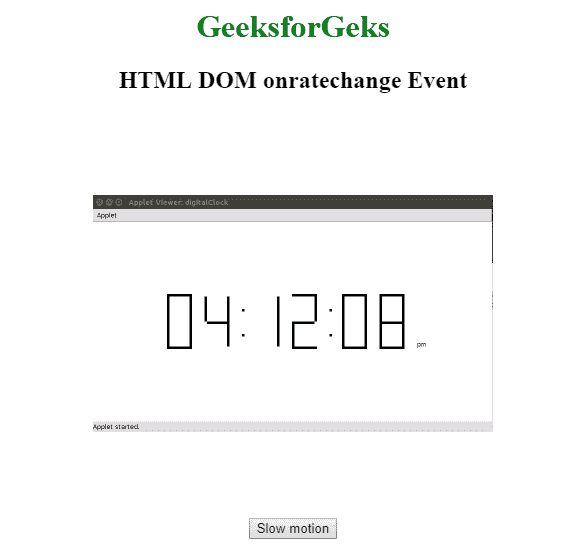
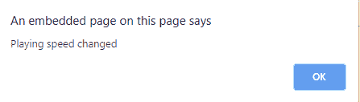

# html | DOM on rate change event

> 哎哎哎:# t0]https://www . geeksforgeeks . org/html-DOM-onerate change-event/

如果音频/视频的播放速度发生变化，就会出现**DOM on ate change 事件**。**回放速率**属性用于设置或返回音频/视频的当前回放速度。
**支持的标签**

**语法:**

*   **在 HTML 中:**

```html
<element onratechange="myScript">
```

*   **在 JavaScript 中:**

```html
object.onratechange = function(){myScript};
```

*   **在 JavaScript 中，使用 addEventListener()方法:**

```html
object.addEventListener("ratechange", myScript);
```

**示例:**使用 addEventListener()方法

## 超文本标记语言

```html
<!DOCTYPE html>
<html>

<head>
    <title>
        HTML DOM onratechange Event
    </title>
</head>

<body>
    <center>
        <h1 style="color:green">
          GeeksforGeks
      </h1>
        <h2>HTML DOM onratechange Event</h2>

        <video id="vidID"
               width="400" height="400"
               autoplay controls>
            <source src=
"https://media.geeksforgeeks.org/wp-content/uploads/20190401140735/g4g2.mp4"
                    type="video/mp4">
        </video>
        <br>

        <button onclick="speed()" type="button">
          Slow motion
      </button>

        <script>
            // Get the video element with id="myVideo"
            var x = document.getElementById("vidID");

            function speed() {
                x.playbackRate = 0.5;
            }

            x.addEventListener("ratechange", GFGfun);

            function GFGfun() {
                alert("Playing speed changed");
            }
        </script>
    </center>
</body>

</html>
```

**输出:**

*   **之前:**



*   **之后:**



**支持的浏览器:**T2 DOM 支持的浏览器如下:

*   谷歌 Chrome
*   Internet Explorer 9.0
*   火狐浏览器
*   苹果 Safari
*   歌剧