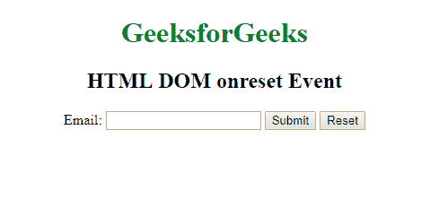

# html | DOM on reset 事件

> 原文:[https://www.geeksforgeeks.org/html-dom-onreset-event/](https://www.geeksforgeeks.org/html-dom-onreset-event/)

当表单被重置时，HTML DOM 中的 **onreset 事件**发生。本事件仅支持 **<表单>** 标签。
**支持的标签**

*   **<形态>**

**语法:**

*   **在 HTML 中:**

```html
<element onreset="myScript">
```

*   **在 JavaScript 中:**

```html
object.onreset = function(){myScript};
```

*   **在 JavaScript 中，使用 addEventListener()方法:**

```html
object.addEventListener("reset", myScript);
```

**示例:**使用 addEventListener()方法

## 超文本标记语言

```html
<!DOCTYPE html>
<html>

<head>
    <title>
      HTML DOM onreset Event
  </title>
</head>

<body>
    <center>
        <h1 style="color:green">
          GeeksforGeeks
      </h1>
        <h2>HTML DOM onreset Event</h2>

        <form id="formID">
            Email:
            <input type="email">
            <input type="submit" value="Submit">
            <input type="reset">
        </form>
    </center>
    <script>
        document.getElementById(
          "formID").addEventListener("reset", GFGfun);

        function GFGfun() {
            alert("Form reset");
        }
    </script>

</body>

</html>
```

**输出:**
**前:**



**之后:**


**支持的浏览器:**设置事件上 **HTML DOM 支持的浏览器如下:** 

*   谷歌 Chrome
*   微软公司出品的 web 浏览器
*   火狐浏览器
*   苹果 Safari
*   歌剧