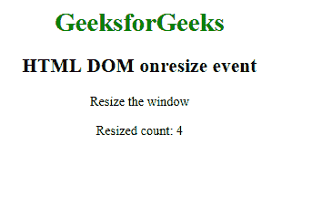

# HTML | DOM on esize 事件

> 原文:[https://www.geeksforgeeks.org/html-dom-onresize-event/](https://www.geeksforgeeks.org/html-dom-onresize-event/)

浏览器窗口调整大小时出现 **HTML DOM onresize 事件**。只有 **<体>** 标签支持此事件。
要获取窗口大小，请使用:

*   clientWidth、clientHeight
*   内侧宽度，内侧高度
*   外宽，外高
*   偏移宽度，偏移高度

**支持的标签**

**语法:**

*   **在 HTML 中:**

```html
<element onresize="myScript">
```

*   **在 JavaScript 中:**

```html
object.onresize = function(){myScript};
```

*   **在 JavaScript 中，使用 addEventListener()方法:**

```html
object.addEventListener("resize", myScript);
```

**例:**

## 超文本标记语言

```html
<!DOCTYPE html>
<html>

<head>
    <title>HTML DOM onresize event</title>
</head>

<body>
    <center>
        <h1 style="color:green">GeeksforGeeks</h1>
        <h2>HTML DOM onresize event</h2>

<p>Resize the window</p>

<p>Resized count: <span id="try">0</span></p>

    </center>
    <script>
        window.addEventListener("resize", GFGfun);

        var c = 0;

        function GFGfun() {
            var res = c += 1;
            document.getElementById("try").innerHTML = res;
        }
    </script>

</body>

</html>
```

**输出:**



**支持的浏览器:****HTML DOM on esize Event**支持的浏览器如下:

*   谷歌 Chrome
*   微软公司出品的 web 浏览器
*   火狐浏览器
*   苹果 Safari
*   歌剧