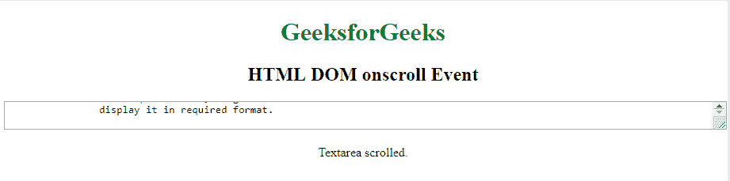

# HTML | DOM on croll 事件

> 原文:[https://www.geeksforgeeks.org/html-dom-onscroll-event/](https://www.geeksforgeeks.org/html-dom-onscroll-event/)

当使用滚动条时，会发生滚动事件。CSS 溢出用于创建滚动条。
T3】支持的标签

*   ，
*   ，
*   ，
*   ，
*   ，
*   ，
*   ，
*   ，
*   ，
*   ，
*   ，
*   ，

    # 至

*   ，
*   ，

*   ，
*   ，<object>*   ，
        1.  ，
        2.  ，
        3.  ，<select>，，</select><textarea></li><li>，<tfoot/></li><li>，<thead/></li><li>，<ul/></li></ul>
<strong>语法:</strong>  
<ul><li><strong>在 HTML 中:</strong>  </li></ul><pre><element onscroll="myScript"></pre><ul><li><strong>在 JavaScript 中:</strong>  </li></ul><pre>object.onscroll = function(){myScript};</pre><ul><li><strong>在 JavaScript 中，使用 addEventListener()方法:</strong>  </li></ul><pre>object.addEventListener("scroll", myScript);</pre><ul><li> </li></ul>
<strong>示例:</strong>使用 addEventListener()方法 

<h2 class="tabtitle">超文本标记语言</h2>
<pre><!DOCTYPE html> <html>   <head>     <title>         HTML DOM onscroll Event     </title> </head>   <body>     
         <h1 style="color:green">           GeeksforGeeks       </h1>         <h2>HTML DOM onscroll Event</h2>         <textarea style="width:100%" id="tID">             HTML stands for Hyper Text Markup Language.           It is used to design web pages using markup language.           HTML is the combination of Hypertext and Markup language.           Hypertext defines the link between the web pages.           Markup language is used to define the text document           within tag which defines the structure of web pages.           HTML is a markup language which is used by the browser           to manipulate text, images and other content to           display it in required format.         </textarea>           

       
        </body>   </html></pre>

<strong>输出:</strong>  

<strong>支持的浏览器:</strong><strong>HTML DOM onscroll 事件</strong>支持的浏览器如下: 
<ul><li>谷歌 Chrome</li><li>微软公司出品的 web 浏览器</li><li>火狐浏览器</li><li>苹果 Safari</li><li>歌剧</li></ul>
 
 </body></html></textarea></object>