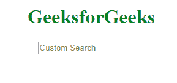
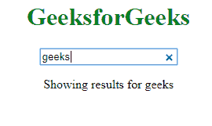

# HTML | DOM onsearch 事件

> 原文:[https://www.geeksforgeeks.org/html-dom-onsearch-event/](https://www.geeksforgeeks.org/html-dom-onsearch-event/)

当用户使用带有**的 **<输入>** 元素进行搜索时，会发生 HTML DOM 中的 **onsearch 事件**。当用户按下*“回车”*或在搜索框中点击*“x”*时，该事件生效。** 

**支持的标签**

**<输入 type="search" >**

**语法:**

*   **在 HTML 中:**

```html
<element onsearch="myScript">
```

*   **在 JavaScript 中:**

```html
object.onsearch = function(){myScript};
```

*   **在 JavaScript 中，使用 addEventListener()方法:**

```html
object.addEventListener("search", myScript);
```

**示例:**使用 addEventListener()方法。

## 超文本标记语言

```html
<!DOCTYPE html>
<html>

<head>
    <title>
      HTML DOM onsearch Event
  </title>
</head>

<body>
    <center>
        <h1 style="color:green">
          GeeksforGeeks
      </h1>
        <input type="search"
               id="searchID"
               placeholder="Custom Search">

        <p id="try"></p>

    </center>
    <script>
        document.getElementById(
          "searchID").addEventListener(
          "search", GFGfun);

        function GFGfun() {
            var GFG = document.getElementById(
              "searchID");

            document.getElementById("try").innerHTML =
              "Showing results for " + GFG.value;
        }
    </script>

</body>

</html>
```

**输出:**
**前搜索:**



**搜索后:**



**支持的浏览器:****HTML DOM on search Event**支持的浏览器如下:

*   谷歌 Chrome
*   苹果 Safari
*   歌剧