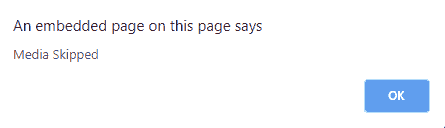

# HTML | DOM onseeking 事件

> 原文:[https://www.geeksforgeeks.org/html-dom-onseeking-event/](https://www.geeksforgeeks.org/html-dom-onseeking-event/)

当用户开始将媒体跳转到一个新位置时，就会发生 HTML DOM 中的 **onseeking 事件**。**突发事件**和**突发事件**正好相反。要获取媒体的当前位置，请使用*当前时间*。

**语法:**

*   **在 HTML 中:**

    ```html
    <element onseeking="Script">
    ```

*   **在 JavaScript 中:**

    ```html
    object.onseeking = function(){Script};
    ```

*   **在 JavaScript 中，使用 addEventListener()方法:**

    ```html
    object.addEventListener("seeking", Script);
    ```

**示例:**使用 addEventListener()方法

```html
<!DOCTYPE html>
<html>

<head>
    <title>
        HTML DOM onseeking Event
    </title>
</head>

<body>
    <center>
        <h1 style="color:green">GeeksforGeeks</h1>
        <h2>HTML DOM onseeking Event</h2>

        <video controls id="videoID">
            <source src=
"https://media.geeksforgeeks.org/wp-content/uploads/20190723123920/secondneon.mp4"
                    type="video/mp4">
        </video>
    </center>
    <script>
        document.getElementById(
        "videoID").addEventListener("seeking", GFGfun);

        function GFGfun() {
            alert("Media Skipped");
        }
    </script>

</body>

</html>
```

**输出:**
**前:**

**后:**


**支持的浏览器:****HTML DOM on seeking Event**支持的浏览器如下:

*   谷歌 Chrome
*   Internet Explorer 9+
*   火狐浏览器
*   苹果 Safari
*   歌剧