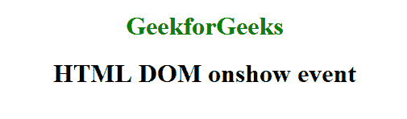
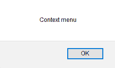
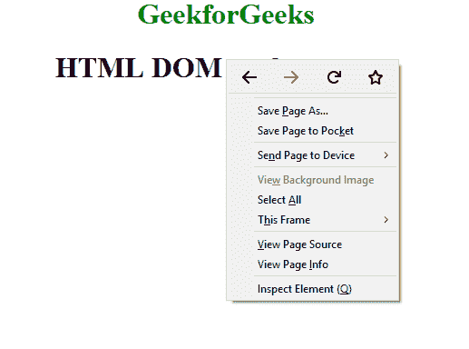

# HTML | DOM onshow Event

> 原文:[https://www.geeksforgeeks.org/html-dom-onshow-event/](https://www.geeksforgeeks.org/html-dom-onshow-event/)

当用户右击 en 元素并且 **<菜单>元素**显示为上下文菜单时，出现 **onshow 事件**。

**支持的标签**

*   **<菜单>**

**语法:**

*   **在 HTML 中:**

```html
<element onshow="Script">
```

*   **在 JavaScript 中:**

```html
object.onshow = function(){Script};
```

*   **在 JavaScript 中，使用 addEventListener()方法:**

```html
object.addEventListener("show", Script);
```

**示例:**使用 addEventListener()方法

## 超文本标记语言

```html
<!DOCTYPE html>
<html>

<head>
    <title>
      HTML DOM onshow event
  </title>
</head>

<head>
    <style>

    </style>
</head>

<body>

    <center>
        <h1 style="color:green">
          GeekforGeeks
      </h1>
        <h1 contextmenu="Mmenu">
          HTML DOM onshow event
      </h1>

        <menu type="context"
              id="Mmenu"></menu>
    </center>
    <script>
        document.getElementById(
          "Mmenu").addEventListener("show", GFGfun);

        function GFGfun() {
            alert("Context menu");
        }
    </script>

</body>

</html>
```

**输出:**
**前:**



**后右键:**





**支持的浏览器:****HTML DOM onshow Event**支持的浏览器如下:

*   火狐浏览器