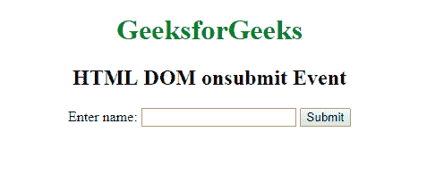
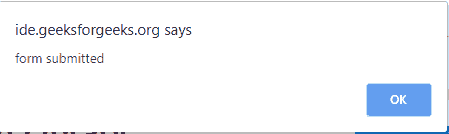

# HTML | DOM onsubmit 事件

> 原文:[https://www.geeksforgeeks.org/html-dom-onsubmit-event/](https://www.geeksforgeeks.org/html-dom-onsubmit-event/)

HTML DOM 中的 **onsubmit 事件**发生在表单提交之后。表单标记支持此事件。
**支持的 HTML 标签:**

*   **<形态>**

**语法:**

*   **在 HTML 中:**

```html
<element onsubmit="Script">
```

*   **在 JavaScript 中:**

```html
object.onsubmit = function(){myScript};
```

*   **在 JavaScript 中，使用 addEventListener()方法:**

```html
object.addEventListener("submit", myScript);
```

**示例:**使用 JavaScript

## 超文本标记语言

```html
<!DOCTYPE html>
<html>

<head>
    <title>
      HTML DOM onsubmit Event
  </title>
</head>

<body>
    <center>
        <h1 style="color:green">GeeksforGeeks</h1>
        <h2>HTML DOM onsubmit Event</h2>
        <form id="formID" action="#">
            Enter name:
            <input type="text" name="fname">
            <input type="submit" value="Submit">
        </form>
    </center>

    <script>
        document.getElementById("formID").onsubmit =
            function() {GFGfun()};

        function GFGfun() {
            alert("form submitted");
        }
    </script>

</body>

</html>
```

**输出:**
**前:**



**之后:**



**示例:**使用 addEventListener()方法

## 超文本标记语言

```html
<!DOCTYPE html>
<html>

<head>
    <title>
      HTML DOM onsubmit Event
  </title>
</head>

<body>
    <center>
        <h1 style="color:green">GeeksforGeeks</h1>
        <h2>HTML DOM onsubmit Event</h2>
        <form id="formID" action="#">
            Enter name:
            <input type="text" name="fname">
            <input type="submit" value="Submit">
        </form>
    </center>

    <script>
        document.getElementById(
          "FormID").addEventListener("submit", GFGfun);

        function GFGfun() {
            alert("form submitted");
        }
    </script>

</body>

</html>
```

**输出:**
**前:**


**之后:**


**支持的浏览器:**提交事件中 **HTML DOM 支持的浏览器如下:** 

*   谷歌 Chrome
*   微软公司出品的 web 浏览器
*   火狐浏览器
*   苹果 Safari
*   歌剧