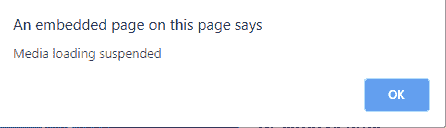

# HTML | DOM on uspend 事件

> 原文:[https://www.geeksforgeeks.org/html-dom-onsuspend-event/](https://www.geeksforgeeks.org/html-dom-onsuspend-event/)

HTML DOM 中的 **onsuspend 事件**发生在浏览器没有获取媒体数据的时候。当媒体加载暂停时，会发生此事件。当下载完成或由于某种中断而暂停时，可能会发生这种情况。
装载过程中出现某种干扰时发生的事件:

*   奥纳博特
*   一个提示
*   不良事件
*   安装

**支持的标签:**

*   **<音频>**
*   **<视频>**

**语法:**

*   **在 HTML 中:**

```html
<element onsuspend="Script">
```

*   **在 JavaScript 中:**

```html
object.onsuspend = function(){Script};
```

*   **在 JavaScript 中，使用 addEventListener()方法:**

```html
object.addEventListener("suspend", Script);
```

**支持的标签:**

*   声音的
*   录像

**示例:**使用 addEventListener()方法

## 超文本标记语言

```html
<!DOCTYPE html>
<html>

<head>
    <title>
        HTML DOM onseeked Event
    </title>
</head>

<body>
    <center>
        <h1 style="color:green">GeeksforGeeks</h1>
        <h2>HTML DOM onseeked Event</h2>

        <video controls id="videoID">
            <source src=
"https://media.geeksforgeeks.org/wp-content/uploads/20190723123920/secondneon.mp4"
                    type="video/mp4">
        </video>
    </center>
    <script>
        document.getElementById(
            "videoID").addEventListener("suspend", GFGfun);

        function GFGfun() {
            alert(
                "Media loading suspended");
        }
    </script>

</body>

</html>
```

**输出:**
**前:**



**之后:**


**支持的浏览器:****HTML DOM on uspend Event**支持的浏览器如下:

*   谷歌 Chrome
*   Internet Explorer 9.0
*   火狐浏览器
*   苹果 Safari
*   歌剧