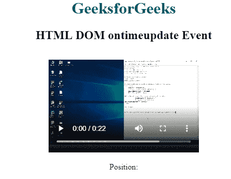
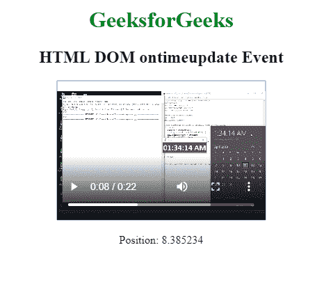

# HTML | DOM ontimeupdate 事件

> 哎哎哎::1230【https://www . geeksforgeeks . org/html-DOM-ontimeupdate-event/中

HTML DOM 中的 **ontimeupdate 事件**发生在播放特定媒体位置的位置发生变化时。
此事件由
调用

*   播放音频/视频
*   移动到音频/视频的新位置

currentTime 属性用于以秒为单位获取音频/视频的当前位置。
**支持的标签**

*   **<音频>**
*   **<视频>**

**语法:**

*   **在 HTML 中:**

```html
<element ontimeupdate="Script">
```

*   **在 JavaScript 中:**

```html
object.ontimeupdate = function(){Script};
```

*   **在 JavaScript 中，使用 addEventListener()方法:**

```html
object.addEventListener("timeupdate", Script);
```

**示例:**使用 addEventListener()方法

## 超文本标记语言

```html
<!DOCTYPE html>
<html>

<head>
    <title>
      HTML DOM ontimeupdate Event
  </title>
</head>

<body>
    <center>
        <h1 style="color:green">
          GeeksforGeeks
      </h1>
        <h2>HTML DOM ontimeupdate Event</h2>

        <video id="videoID" controls>
            <source src="GFG.mp4" type="video/mp4">
        </video>

<p>Position: <span id="try"></span></p>

    </center>
    <script>
        var GFG = document.getElementById("videoID");

        GFG.addEventListener("timeupdate", GFGfun);

        function GFGfun() {
            document.getElementById(
              "try").innerHTML = GFG.currentTime;
        }
    </script>

</body>

</html>
```

**输出:**
**前:**



**之后:**



**支持的浏览器:****HTML DOM on time update 事件**支持的浏览器如下:

*   谷歌 Chrome
*   微软公司出品的 web 浏览器
*   火狐浏览器
*   苹果 Safari
*   歌剧